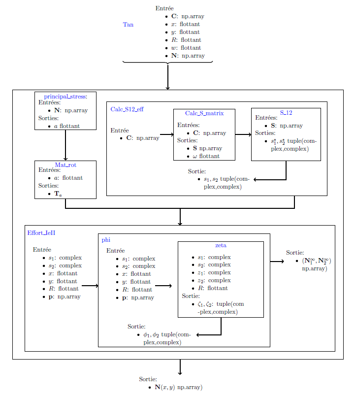

<!--
 Copyright 2021 IRT Saint Exupéry, https://www.irt-saintexupery.com

 This work is licensed under the Creative Commons Attribution-ShareAlike 4.0
 International License. To view a copy of this license, visit
 http://creativecommons.org/licenses/by-sa/4.0/ or send a letter to Creative
 Commons, PO Box 1866, Mountain View, CA 94042, USA.
-->

# Tan Model Equations

## Principal stress coordinate system

The coordinate system (x,y) is rotated to the **principal stress frame (1,2)**.

The rotation angle is:

$$
\alpha =
\begin{cases}
\frac{1}{2}\arctan\left(\frac{N_{xy}}{N_{xx}-N_{yy}}\right) & N_{xx}\neq N_{yy} \\
\frac{\pi}{4} & \text{otherwise}
\end{cases}
$$

## Load transformation

The load vector is transformed using a rotation matrix:

$$
p = T_\alpha N
$$

where \(T_\alpha\) is the rotation matrix.

## Stress field computation

In this coordinate system, the membrane stress solution for an infinite anisotropic plate with a hole in
its thickness is determined using a complex method. For each load component, p1 and p2,
there corresponds a membrane stress field denoted respectively as $N1(x, y)$ and $N2(x, y)$. These are expressed
as the combination of a uniform membrane stress and a stress resulting from the hole. For any point
with coordinates (x, y) in the initial coordinate system, the solution fields are expressed by

TODO equations for N1 and N2

where $z1(x, y)$ and $z2(x, y)$ are the functions defined respectively by $z1(x, y) := x + s1 y$ and $z2(x, y) := x + s2 y$,
and $\phi_1$, $\phi_2$, $s1$, and $s2$ are variables whose calculation is specified in the following section. $Re(·)$ corresponds to the real part function.

Once these two fields are calculated, they are combined (principle of superposition) and returned
to the coordinate system of the original load to obtain the membrane stress field at infinity $N∞(x, y)$.

Furthermore, a correction must be applied to account for the fact that the plate is
not infinite. To do this, we multiply the load $N∞(x, y)$ by a factor $C=\frac{w}{2R}$
to give $N(x, y) = C w 2R N∞(x, y)$ with

TODO insert equation

Because the theoretical formulation assumes an infinite plate, a correction
factor is applied for a finite plate width \(w\):

$$
C = \frac{2 + (1-u)^3}{3 - 3u}, \quad u = \frac{2R}{w}
$$

This factor is a theoretical value for quasi-isotropic materials and is extended to all types of laminates.

The total stress field is obtained using superposition:

$$
N(x,y) = N_1(x,y) + N_2(x,y)
$$

## Degenerate quasi‑isotropic case

When the material becomes quasi‑isotropic, the characteristic roots may
coincide. In numerical implementations, a small perturbation of the stiffness
matrix can be introduced to avoid singularities.

## Computational steps

