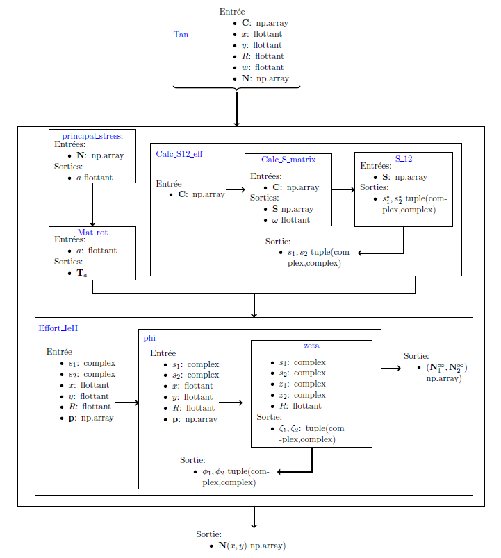

<!--
 Copyright 2021 IRT Saint Exupery, https://www.irt-saintexupery.com

 This work is licensed under the Creative Commons Attribution-ShareAlike 4.0
 International License. To view a copy of this license, visit
 http://creativecommons.org/licenses/by-sa/4.0/ or send a letter to Creative
 Commons, PO Box 1866, Mountain View, CA 94042, USA.
-->

# Tan Model Equations

## Principal stress coordinate system

The coordinate system (x,y) is rotated to the **principal stress frame (1,2)**.

The rotation angle is:

$$
\alpha =
\begin{cases}
\frac{1}{2}\arctan\left(\frac{N_{xy}}{N_{xx}-N_{yy}}\right) & if N_{xx}\neq N_{yy} \\
\frac{\pi}{4} & \text{otherwise}
\end{cases}
$$

## Load transformation

The load vector is transformed using a rotation matrix:

$$
p = T_\alpha N
$$

where $T_\alpha$ is the rotation matrix.

## Stress field computation

In this coordinate system, the membrane stress solution for an infinite anisotropic plate with a hole in
its thickness is determined using a complex method. For each load component, p1 and p2,
there is a membrane stress field denoted respectively as $N_1(x, y)$ and $N_2(x, y)$. These are expressed
as the combination of a uniform membrane stress and a stress resulting from the hole. For any point
with coordinates (x, y) in the initial coordinate system, the solution fields are expressed as follows.

The field driven by the load component \(p_1\) is

$$
N_1(x,y) =
\begin{pmatrix}
p_1 + 2\,\mathrm{Re}\!\left(s_1^2\,\phi_1^{(1)} + s_2^2\,\phi_2^{(1)}\right) \\[4pt]
2\,\mathrm{Re}\!\left(\phi_1^{(1)} + \phi_2^{(1)}\right) \\[4pt]
-2\,\mathrm{Re}\!\left(s_1\,\phi_1^{(1)} + s_2\,\phi_2^{(1)}\right)
\end{pmatrix},
$$

and the field driven by the load component \(p_2\) is

$$
N_2(x,y) =
\begin{pmatrix}
2\,\mathrm{Re}\!\left(s_1^2\,\phi_1^{(2)} + s_2^2\,\phi_2^{(2)}\right) \\[4pt]
p_2 + 2\,\mathrm{Re}\!\left(\phi_1^{(2)} + \phi_2^{(2)}\right) \\[4pt]
-2\,\mathrm{Re}\!\left(s_1\,\phi_1^{(2)} + s_2\,\phi_2^{(2)}\right)
\end{pmatrix},
$$

where each vector collects the \((N_{xx}, N_{yy}, N_{xy})\) components and
\(\mathrm{Re}(\cdot)\) is the real part. The complex potentials \(\phi_j^{(k)}\)
(root \(j \in \{1,2\}\), load component \(k \in \{1,2\}\)) are

$$
\begin{aligned}
\phi_1^{(1)} &= \frac{-i\,p_1\,\bigl(1 - \zeta_1\bigr)}{2\,(s_1 - s_2)\,(1 + i\,s_1)}, &
\phi_2^{(1)} &= \frac{i\,p_1\,\bigl(1 - \zeta_2\bigr)}{2\,(s_1 - s_2)\,(1 + i\,s_2)}, \\[6pt]
\phi_1^{(2)} &= \frac{p_2\,s_2\,\bigl(1 - \zeta_1\bigr)}{2\,(s_1 - s_2)\,(1 + i\,s_1)}, &
\phi_2^{(2)} &= \frac{-p_2\,s_1\,\bigl(1 - \zeta_2\bigr)}{2\,(s_1 - s_2)\,(1 + i\,s_2)},
\end{aligned}
$$

with the auxiliary mapping functions

$$
\zeta_j(x,y) = \frac{z_j}{\sqrt{z_j^2 - R^2\,(1 + s_j^2)}}, \qquad
z_j(x,y) = x + s_j\,y, \quad j \in \{1,2\},
$$

where the branch of the square root is chosen so that \(\mathrm{Re}(\zeta_j) \geq 0\).
The characteristic roots \(s_1\) and \(s_2\) are obtained from the effective
compliance matrix (see the following section).

## Superposition and finite-width correction

The two fields are combined by superposition and rotated back to the coordinate
system of the original load to obtain the membrane stress field for an infinite
plate:

$$
N_\infty(x,y) = T_\alpha^{-1}\,\bigl(N_1(x,y) + N_2(x,y)\bigr).
$$

Because the theoretical formulation assumes an infinite plate, a correction
factor \(C\) is applied to account for the finite plate width \(w\):

$$
N(x,y) = C\,N_\infty(x,y), \qquad
C = \frac{2 + (1-u)^3}{3 - 3u}, \quad u = \frac{2R}{w}.
$$

This factor is a theoretical value for quasi-isotropic materials and is extended
to all types of laminates.

## Degenerate quasi‑isotropic case

When the laminate approaches in‑plane isotropy, two distinct singularities
appear in the formulation. The implementation regularises each one
deterministically rather than by perturbing the stiffness matrix, so that the
result stays reproducible across platforms and BLAS back‑ends.

### Undefined orthotropy frame

The orthotropy axis angle \(\omega\) is normally identified from the
extension–shear coupling terms and the \(C_{11}-C_{22}\) asymmetry of the
stiffness matrix, essentially as

$$
\omega \sim \arctan\!\left(\frac{\text{coupling}}{\text{asymmetry}}\right).
$$

For a quasi‑isotropic laminate both the coupling and the asymmetry vanish, so
this ratio becomes an ill‑defined \(0/0\). The orthotropy axes are then
genuinely undefined — every rotation leaves the stiffness invariant. When both
quantities fall below a relative tolerance (\(10^{-9}\,\lVert C\rVert\)), the
frame is fixed to the arbitrary but exact choice \(\omega = 0\), i.e. the
current coordinate frame is kept.

### Coincident characteristic roots

The complex potentials \(\phi_1\) and \(\phi_2\) divide by \(s_1 - s_2\), which
vanishes at the isotropic double root \(s_1 = s_2 = i\). The stress field has a
finite (removable) limit there, but the direct evaluation loses all precision
once \(\lvert s_1 - s_2\rvert\) drops below \(\sim 10^{-6}\), and yields `NaN`
at exactly zero.

To keep the computation well conditioned, the separation of the roots is floored
to a minimum value \(\delta_{\min} = 10^{-4}\). The two roots are pushed
symmetrically apart about their midpoint, along the physical direction of the
separation:

$$
s_{1,2} \leftarrow \frac{s_1 + s_2}{2} \pm \frac{\delta_{\min}}{2}\,
\frac{s_1 - s_2}{\lvert s_1 - s_2\rvert}, \quad \text{when } \lvert s_1 - s_2\rvert < \delta_{\min}.
$$

For an exactly double root the separation direction is undefined and the
imaginary axis is chosen (both roots sit near \(+i\)). Because the stress field
is continuous in \((s_1, s_2)\), the bias introduced by this flooring is of the
order of \(\delta_{\min}\) and negligible for engineering purposes.

## Computational steps

