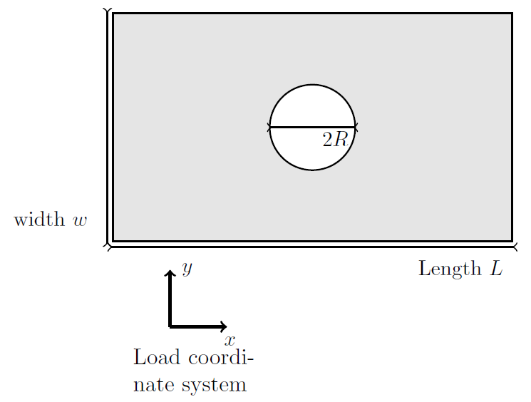
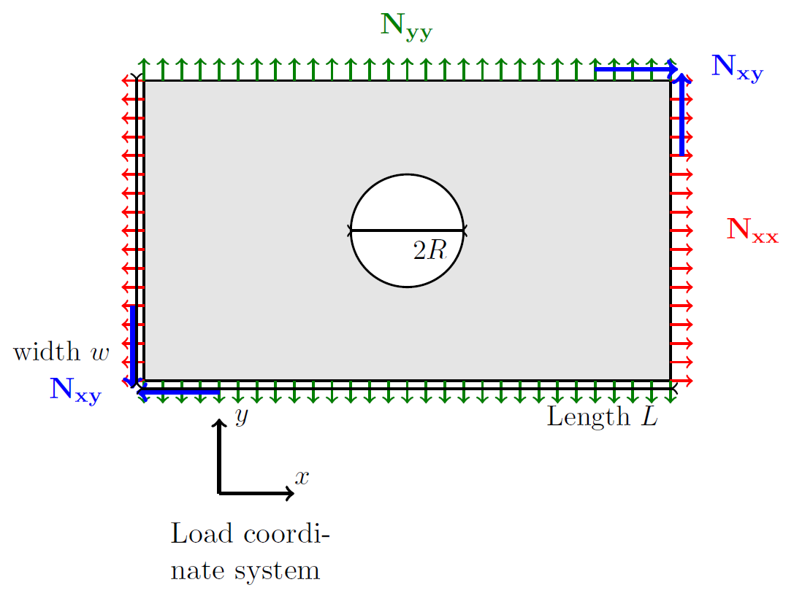

<!--
 Copyright 2021 IRT Saint Exupéry, https://www.irt-saintexupery.com

 This work is licensed under the Creative Commons Attribution-ShareAlike 4.0
 International License. To view a copy of this license, visit
 http://creativecommons.org/licenses/by-sa/4.0/ or send a letter to Creative
 Commons, PO Box 1866, Mountain View, CA 94042, USA.
-->

# Theory – Open Hole Plate

## Introduction

The **Tan model** provides an analytical formulation for computing membrane stress
fields in an infinite orthotropic plate with a circular hole.



### Assumptions

1. The plate is considered infinite
2. The material behaviour is linear elastic orthotropic
3. The loading is planar

### Multiaxial loading

The applied load is defined as:

```
N = (Nxx, Nyy, Nxy)
```



The model relies on the **principle of superposition**: the response to multiaxial
loading can be decomposed into the sum of responses to each load component.
