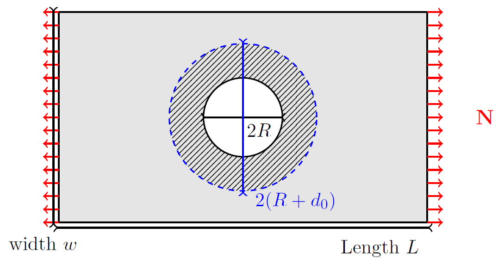
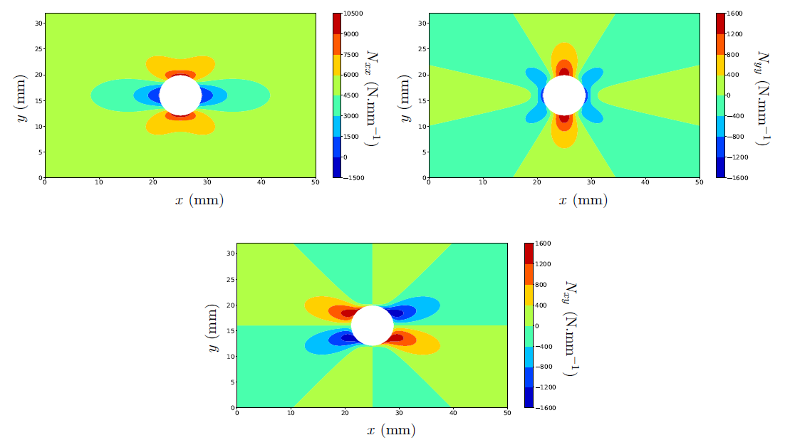

<!--
 Copyright 2021 IRT Saint Exupéry, https://www.irt-saintexupery.com

 This work is licensed under the Creative Commons Attribution-ShareAlike 4.0
 International License. To view a copy of this license, visit
 http://creativecommons.org/licenses/by-sa/4.0/ or send a letter to Creative
 Commons, PO Box 1866, Mountain View, CA 94042, USA.
-->

# Tan model validity

Tan’s model is based on an elastic approximation. However, at the edge of the hole, this approximation leads
to infinite stresses that are not physically realistic. Therefore, it is necessary to consider
a region of validity for Tan’s model that excludes a certain area around the hole. To do this, we increase
the radius of the hole by a distance $d0$. This parameter, called the stress point distance, is calibrated based on
tests and comparisons with finite element calculations. The geometry corresponding to this new
configuration is illustrated in the following figure:

In the previous figure, the stress concentration zone is clearly visible, where the elastic model is no longer valid.

## Example of results

