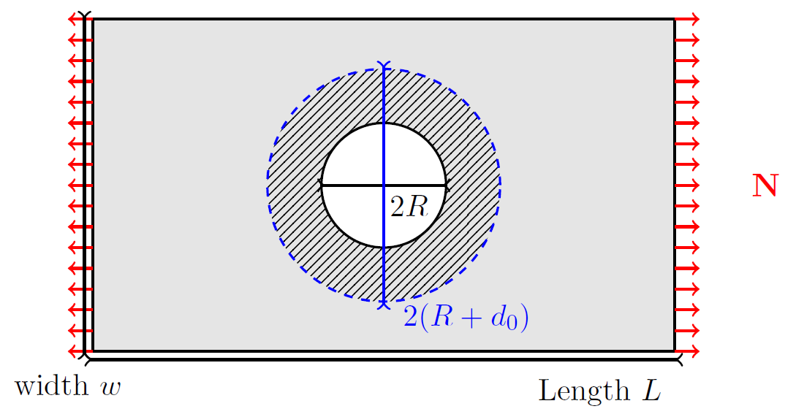
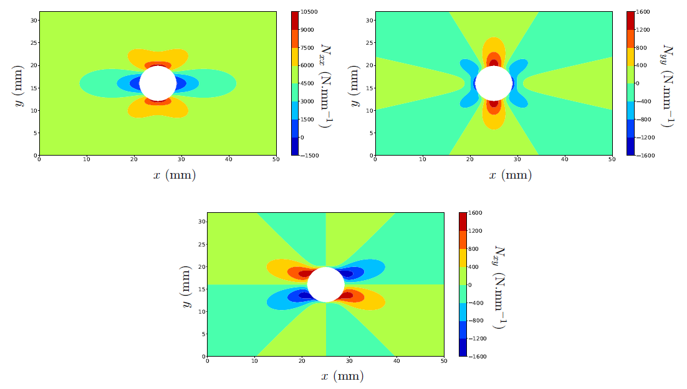

<!--
 Copyright 2021 IRT Saint Exupery, https://www.irt-saintexupery.com

 This work is licensed under the Creative Commons Attribution-ShareAlike 4.0
 International License. To view a copy of this license, visit
 http://creativecommons.org/licenses/by-sa/4.0/ or send a letter to Creative
 Commons, PO Box 1866, Mountain View, CA 94042, USA.
-->

# Tan model validity

Tan's model is based on an elastic approximation.
However, when damage occurs (matrix cracking, and possibly later some fibers failure), there are some local stress redistributions and the considered linear elastic law b
becomes invalid locally. Engineers use the "point-stress" method,
as a correction of basic linear-elastic results, in order to estimate the occurence of substancial damage propagation (fibre failure). This method consists in observing the
stress value (computed from a fully elastic structure) at a distance 'd_0' from the hole ("point-stress distance"), instead of the direct vicinity of the hole. Despite some physical meaningfulness of 'd_0', its value is actually identified from tests and it is highly sensitive to many parameters
(material ply properties, layup, size of the hole, etc).
The geometry corresponding to this new configuration is illustrated in the following
figure:

In the previous figure, the stripped area is where the computed stress is ignored, for estimation of damage occurence. Note that for a critical loading, it also matches approximately where the elastic model is no longer valid

## Example of results

