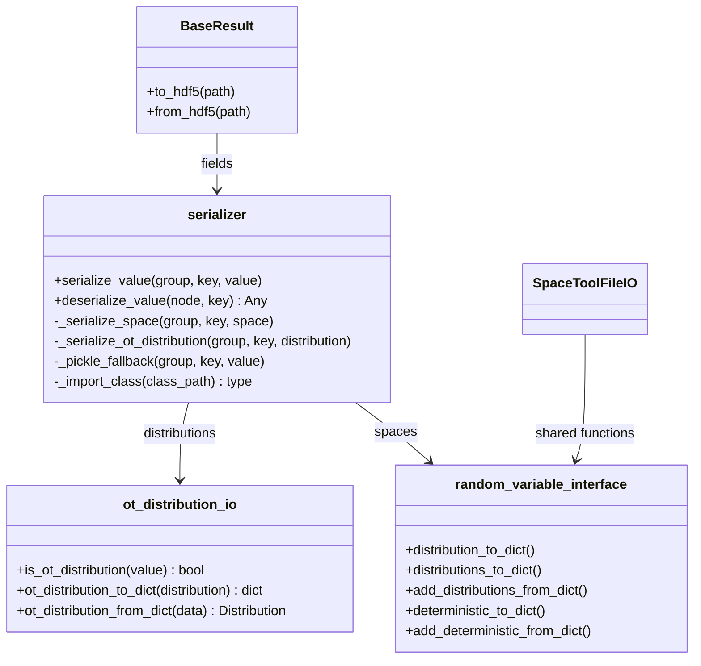

# Serialization of the tool results in clear

## Requirements

- Write the tool results to HDF5 in a readable, version-tolerant form, instead of
  opaque pickle blobs, for the types VIMSEO results actually hold: Pydantic settings,
  enumerations, paths, parameter and design spaces, OpenTURNS distributions.
- Read every result file written before this change unchanged.
- Never fail to write a result: fall back to a pickle blob for what cannot be
  described in clear.
- Describe in clear the settings in the JSON summary of a tool run (SPEC-004).

Acceptance criteria:

- Given a result holding a Pydantic model, an `Enum` (including `str`/`int`
  subclasses), a `Path`, a `datetime`, a `date`, a `complex`, `bytes`, a `set`, a
  `frozenset`, an `OrderedDict`, or a dict with non-string keys, when written and read
  back, then the value and its type are equal.
- Given a `ParameterSpace` or `DesignSpace` built with the VIMSEO API, then it is
  written in clear and rebuilt with the same variables and distributions.
- Given an OpenTURNS univariate, truncated or joint distribution, then it is written in
  clear and rebuilt; given one that cannot be (e.g. `DeconditionedDistribution`), then
  it is pickled.
- Given an HDF5 file written by a previous version, then it is read as before.

## Entities

## Approach

1. Typed codecs in `serializer.py`:
   - Each value is written with a type tag; new tags are additive, and the reader keeps
     explicit fallbacks for the groups written by older versions.
   - `Enum` is checked before the primitive branch, so that a `str` or `int` enum keeps
     its type.
   - `Path` is stored POSIX-style, for portability.
   - Dicts keep their order and `OrderedDict`-ness, and encode non-string keys.
   - Pydantic models are written recursively, without flattening nested models.
2. Spaces:
   - `ParameterSpace`/`DesignSpace` are described with the per-marginal
     `vimseo_settings` attached by `add_random_variable_interface`, through functions
     shared with the JSON export (`SpaceToolFileIO`).
   - If a variable was not built through the VIMSEO API, the whole space is pickled:
     GEMSEO has no public API to graft a built random variable into a space.
3. OpenTURNS distributions:
   - Univariate: class name and parameters; truncated: distribution and bounds; joint:
     marginals and copula. The description is checked by rebuilding the distribution,
     else pickle.
   - In tables and MLflow params, a distribution is shown by its short form.
4. Fixes found on the way: six `BaseResult` subclasses missing `@dataclass` (their fields
   were not serialized); the reconstruction of a native Weibull distribution
   (`KeyError('OTWeibullMinDistribution')`).
5. Rejected alternative: keeping pickle as the default — unreadable without Python and
   broken by class changes.

## Structure

### Inheritance Relationships

1. Result classes are dataclasses deriving from `BaseResult`.

### Dependencies

1. `BaseResult.to_hdf5`/`from_hdf5` → `serialize_value`/`deserialize_value`.
2. `serializer` → `random_variable_interface`, `ot_distribution_io`.
3. `SpaceToolFileIO` → `random_variable_interface` (same JSON shape as before).
4. `base_tool_archive._to_json_value` → `ot_distribution_to_dict` for the summaries.

### Layered Architecture

1. `tools/serializer.py`: HDF5 codecs.
2. `utilities/ot_distribution_io.py`, `tools/space/random_variable_interface.py`:
   domain object ↔ dict conversions, usable by any format.
3. `io/space_io.py`: the JSON export of the spaces.

## Operations

### Extend - `vimseo/tools/serializer.py`

1. Add codecs: Pydantic `BaseModel`, `Enum`, `Path`, `datetime`, `date`, `complex`,
   `bytes`, `set`, `frozenset`, ordered dict with typed keys (`_encode_dict_key`,
   `_decode_dict_key`).
2. Factor `_import_class(class_path)`.
3. Add `_serialize_space` and `_serialize_ot_distribution`, with `_pickle_fallback`.
4. `deserialize_value`: legacy fallbacks for groups without the new attributes.

### Create - `vimseo/utilities/ot_distribution_io.py`

1. `is_ot_distribution`, `get_class_name`, `ot_distribution_to_dict`,
   `ot_distribution_from_dict`.

### Refactor - `vimseo/tools/space/random_variable_interface.py`

1. Move `distribution_to_dict`, `distributions_to_dict`, `add_distributions_from_dict`
   from `space_io.py`; add `deterministic_to_dict`, `add_deterministic_from_dict`.
2. Fix the native Weibull reconstruction.

### Fix - result classes

1. Add `@dataclass` to `DatasetResult`, `MaterialResult`, `DirectMeasuresResult`,
   `SolutionVerificationCaseResult`, `ModelResult` (`tools/model_tool.py`),
   `MockToolResult`.

### Update - tool run summaries

1. `_to_json_value`: OpenTURNS distributions in clear in the summary; short form in
   MLflow params (SPEC-005).

### Tests

1. `tests/tools/test_serialization.py`: round trip of each type, spaces, distributions,
   fallbacks, legacy files.

## Norms

1. The shared norms of `docs/specs/index.md`.
2. A new codec adds a new type tag; an existing tag is never changed.
3. A conversion to and from a dict lives next to its domain object, not in a format
   module.

## Safeguards

1. Compatibility: every HDF5 file written before this change is read unchanged.
2. Functional: writing never fails because of an unsupported type (pickle fallback).
3. Breaking change (SPEC-004): results can no longer be saved to or loaded from the
   `pickle` format by `BaseTool`.
4. Tests: `tests/tools/test_serialization.py`, `tests/io/test_io_space_tool.py`.

## Open questions

1. `DistributionSettings.model_config` declares `extra="forbid"` without effect;
   enabling it breaks `tests/tools/test_validation_point.py` (a `parameters` keyword is
   silently ignored). Fix it in a separate canvas?
2. Should the pickle fallback log a warning, so that users know a value is not
   readable in clear?
3. `DesignSpace.__eq__` ignores the distributions: should VIMSEO provide a comparison
   including them?
