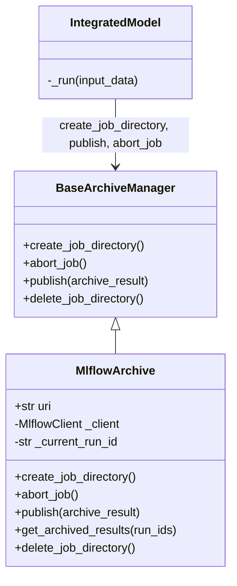

# MLflow run archive isolated from the global MLflow state

## Requirements

- Make `MlflowArchive`, the MLflow archive of the simulations, independent of any
  process-wide MLflow state, so that several archives, the tool archive (SPEC-005) and
  the user's own MLflow code coexist in one process.
- Make the archived run exist from the start of the simulation, so that the outputs,
  the model cache and the archive agree, and a failed simulation is visible as such.
- Out of scope: the archive of the tool results (SPEC-005).

Acceptance criteria:

- Given two models archived in two MLflow databases in the same process, then each
  writes and reads its own database.
- Given a model executed with `MlflowArchive`, then `directory_archive_job` is known in
  the outputs returned by `execute()` and equals the artifact directory of the run.
- Given a simulation which raises, then its MLflow run is `FAILED` and is not returned
  by `get_archived_results()`.
- Given a `DELETE_ALWAYS` persistency policy, then the current run is deleted, not the
  previous one.
- Given an archive created and used, then `mlflow.get_tracking_uri()` is unchanged.

## Entities

## Approach

1. One client per archive:
   - Every MLflow call (`log_artifact`, `search_runs`, `set_experiment`, ...) goes
     through the archive's own `MlflowClient`, bound to its tracking URI
     (`get_tracking_uri(root)`).
   - The constructor no longer calls `mlflow.set_experiment` nor
     `mlflow.set_tracking_uri`.
2. Run life cycle aligned on the job:
   - `create_job_directory()`, called at the start of `IntegratedModel._run`, creates the
     run and sets the job directory from its artifact URI.
   - `publish()` logs into that run with `log_batch` (chunked to the MLflow limits),
     then marks it `FINISHED`; it creates the run itself if none exists.
   - New hook `BaseArchiveManager.abort_job()` (no-op by default), called by
     `IntegratedModel._run` when the job raises: the MLflow run is marked `FAILED`.
   - `get_archived_results()` only returns `FINISHED` runs.
3. Windows: the artifact directory is built with `url2pathname`.
4. Rejected alternative: keeping the global tracking URI as a convenience for user
   scripts — with several archives, the last one created silently wins.

## Structure

### Inheritance Relationships

1. `MlflowArchive` extends `BaseArchiveManager` and overrides `abort_job`.

### Dependencies

1. `IntegratedModel._run` calls `create_job_directory`, then `archive_outputs` (which
   publishes), or `abort_job` on any exception.
2. `MlflowArchive` depends only on its `MlflowClient`.

### Layered Architecture

1. `storage_management/base_archive_storage.py`: the archive interface, with
   `abort_job`.
2. `storage_management/mlflow_storage.py`: the MLflow backend of the simulations, and
   `get_tracking_uri`, shared with the tool archive.

## Operations

### Update interface - `BaseArchiveManager`

1. Add `abort_job()`: release what `create_job_directory` allocated after a failure;
   no-op by default.

### Update backend - `MlflowArchive`

1. `__init__`: build `MlflowClient(tracking_uri=uri)`; no global call.
2. `create_job_directory()`: create the run in the experiment, set
   `_current_run_id` and the job directory from the artifact URI.
3. `publish(archive_result)`: split into tags, params, metrics as before; `log_batch`
   in chunks; `set_terminated(FINISHED)`.
4. `abort_job()`: if a run is open, terminate it as `FAILED`.
5. `copy_persistent_files()`: no-op without a current run (an empty run id would make
   MLflow create a stray run).
6. `delete_job_directory()`: delete the current run through the client; reset the run
   id.
7. `_search_finished_run_ids()`: paginate with the client; only `FINISHED` runs.

### Update model - `IntegratedModel._run`

1. Wrap the chain execution and `archive_outputs` in `try`; call
   `self._archive_manager.abort_job()` on `BaseException`, then re-raise.

### Update documentation

1. `plot_03_model_result_management`: call
   `mlflow.set_tracking_uri(model.archive_manager.uri)` before using the fluent API.
2. `CHANGELOG.md`: breaking change and fixes.

## Norms

1. The shared norms of `docs/specs/index.md`.
2. No call to the fluent MLflow API (`mlflow.*` module functions using global state) in
   VIMSEO code.
3. Any batch logged to MLflow is chunked to its limits (`_chunks`).

## Safeguards

1. Functional: one MLflow run per simulation; the job directory metadata is the
   artifact directory.
2. Functional: a failed simulation leaves a `FAILED` run, never a `RUNNING` one.
3. Breaking change `683b838d` (`refactor(mlflow)!`): `MlflowArchive` no longer sets the
   global tracking URI. A user script using the fluent API must call
   `mlflow.set_tracking_uri(model.archive_manager.uri)` itself, otherwise it silently
   queries `./mlruns`.
4. Tests: `tests/storage_management/test_mlflow_archive.py` (two archives, job
   directory, failure, deletion, global URI unchanged).

## Open questions

1. Should VIMSEO warn when the global tracking URI differs from the archive URI, to
   help the scripts broken by `683b838d`?
2. Should `abort_job` also clean the scratch directory of a directory archive?
