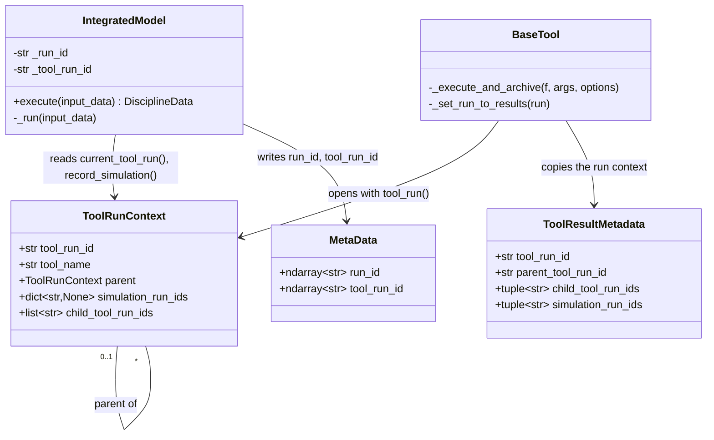

# Identifiers of the simulations and of the tool runs

## Requirements

- Give every simulation and every tool run a unique identifier, so that a VV&UQ result
  can be traced down to the simulations it used, and a simulation up to the tool run
  which created it.
- Record the link without any explicit passing between tools and models: a model does
  not know it is executed by a tool.
- Count as used the simulations read from the model cache, which are not run again.
- Out of scope: the archives themselves (SPEC-004, SPEC-005) and the search of the tool
  results using a given simulation.

Acceptance criteria:

- Given a model executed twice with different inputs, when the outputs are read, then
  each holds its own `run_id`.
- Given a simulation read from the cache, then it keeps the `run_id` and `tool_run_id`
  of the run which created it, and it is listed in `simulation_run_ids` of the current
  tool run.
- Given a tool executing another tool, then the child result has the
  `parent_tool_run_id` of the parent, the parent lists it in `child_tool_run_ids`, and
  the parent's `simulation_run_ids` include those of the child.
- Given a result saved to HDF5 and loaded back, then its identifiers are unchanged.

## Entities

## Approach

1. Identifiers:
   - `run_id` identifies a simulation, `tool_run_id` a tool run. Both are
     `uuid4().hex`, generated by `new_run_id()`.
   - A `run_id` is generated in `IntegratedModel._run`, i.e. only when the model is
     really run. A cached simulation keeps its identifiers.
   - The VIMSEO `run_id` is not the identifier of a database (e.g. an MLflow run id):
     the archives map it to theirs.
2. Propagation through a context variable:
   - `tool_run(tool_name)` is a context manager setting the current `ToolRunContext`
     in a `ContextVar`. Its parent is the tool run current when it starts.
   - A model reads `current_tool_run()` to get its `tool_run_id`, and records its
     simulation with `record_simulation_from_outputs()`.
   - Rejected alternative: passing the tool run explicitly to the models. It would
     change the signature of every tool and of the GEMSEO execution path.
3. Recording the simulations:
   - The recording is done in `IntegratedModel.execute`, not in `_run`, because `_run`
     is skipped when the outputs come from the cache.
   - When a child tool run ends, its `simulation_run_ids` are merged into its parent's
     and its identifier is appended to `child_tool_run_ids`.
   - `simulation_run_ids` is a dict used as an ordered set (order of first use).
4. Storage in the results:
   - The simulation identifiers are model metadata (`MetaData.run_id`,
     `MetaData.tool_run_id`), hence outputs of the model, stored in the cache and in
     the run archives.
   - The tool run identifiers are fields of `ToolResultMetadata`, as tuples: writing a
     list of thousands of strings to HDF5 is quadratic, a tuple takes milliseconds.
5. Compatibility:
   - A first version made the identifiers optional outputs, for the caches of older
     versions. A fix completing the identifiers of an old cache (`2e085900`) was
     reverted (`03167b1d`); then, since no result had been archived by a previous
     version, the identifiers were made required (`47987df0`).
   - `ToolResultMetadata.run_id` was renamed `tool_run_id`, and `parent_run_id`
     `parent_tool_run_id` (`97efd0bc`), so that `run_id` only refers to a simulation.

## Structure

### Inheritance Relationships

1. `IntegratedModel` extends `GemseoDisciplineWrapper` and overrides `execute`.
2. `ToolResultMetadata` extends `BaseMetadata`.

### Dependencies

1. `BaseTool._execute_and_archive` opens `tool_run(self.name)` around the execution of
   the tool, then calls `_set_run_to_results(run)`.
2. `IntegratedModel._run` calls `new_run_id()` and `current_tool_run()`.
3. `IntegratedModel.execute` calls `record_simulation_from_outputs()`.
4. `IntegratedModel` metadata generation writes `MetaDataNames.run_id` and
   `MetaDataNames.tool_run_id`.

### Layered Architecture

1. `core/run_context.py`: the tool run context, with no dependency on tools nor models.
2. `core/` (models): produce and record the simulation identifiers.
3. `tools/` (`BaseTool`, `ToolResultMetadata`): open the tool runs and store their
   identifiers in the results.

## Operations

### Create module - `vimseo/core/run_context.py`

1. Responsibility: the tool run being executed, seen from the models.
2. Attributes:
   - `RUN_ID_NAME = "run_id"`: the model output holding the identifier of a simulation.
   - `_CURRENT_TOOL_RUN: ContextVar[ToolRunContext | None]`, default `None`.
3. Methods:
   - `new_run_id() -> str`: `uuid.uuid4().hex`.
   - `current_tool_run() -> ToolRunContext | None`.
   - `tool_run(tool_name)`: context manager.
     - Create `ToolRunContext(new_run_id(), tool_name, parent=current)`, set it.
     - On exit, in all cases (`finally`): reset the variable; if a parent exists,
       append the child id to `parent.child_tool_run_ids` and merge the
       `simulation_run_ids` into the parent's.
   - `record_simulation(run_id)`: add to the current context, if any and if
     `run_id != ""`.
   - `record_simulation_from_outputs(output_data)`: if there is a current tool run and
     the outputs hold `run_id`, record `str(np.atleast_1d(run_id)[0])`. The outputs may
     have no `run_id` when a GEMSEO formulation restricts the outputs of the model.

### Update model metadata - `vimseo/core/model_metadata.py`

1. Add `run_id: ndarray[str]` and `tool_run_id: ndarray[str]` to `MetaData`, with
   docstrings, and to `DEFAULT_METADATA`.
2. The identifiers are required outputs of the models.

### Update model - `IntegratedModel` (`vimseo/core/base_integrated_model.py`)

1. Initialize `_run_id` and `_tool_run_id` to `""`.
2. `_run`: before executing the chain, set `_run_id = new_run_id()` and
   `_tool_run_id` from `current_tool_run()` (`""` outside a tool run).
3. Override `execute(input_data)`: call `super().execute`, then
   `record_simulation_from_outputs(output_data)`.
4. Write both identifiers in the metadata of the outputs.

### Update tool result metadata - `ToolResultMetadata` (`vimseo/tools/metadata.py`)

1. Add `tool_run_id: str = ""`, `parent_tool_run_id: str = ""`,
   `child_tool_run_ids: tuple[str, ...] = ()`, `simulation_run_ids: tuple[str, ...] = ()`.

### Update tool - `BaseTool` (`vimseo/tools/base_tool.py`)

1. In the `validate` decorator, execute the tool inside `tool_run(self.name)`.
2. `_set_run_to_results(run)`: copy the four identifiers to `self.result.metadata`,
   converting the collections to tuples.

### Update the reference data shipped in the repository

1. Add `run_id`, `tool_run_id` to the archived simulations and the tool results used by
   the tests and the examples, so that they are read with the required fields.

## Norms

1. The shared norms of `docs/specs/index.md`.
2. The identifier of a simulation is named `run_id`, the one of a tool run
   `tool_run_id`, everywhere: metadata, summaries, MLflow tags, settings, docs.
3. Identifier collections written to HDF5 are tuples.
4. `run_context` depends on nothing in VIMSEO: it can be imported by models and tools
   without cycles.

## Safeguards

1. Functional: a simulation retrieved from the cache keeps its identifiers and is
   recorded by the current tool run.
2. Functional: a tool run is closed even when the tool raises; the context of the
   parent is restored.
3. Functional: recording outside a tool run does nothing; outputs without `run_id` are
   ignored.
4. Technical: a `ContextVar` is local to a thread and not passed to a child process.
   The simulations executed by a thread or process pool started during a tool run are
   **not** recorded. No tool does it today.
5. Breaking changes:
   - `47987df0` (`refactor!`): `run_id` and `tool_run_id` are required model outputs;
     an archived simulation and a JSON tool result must hold them. A model cache
     written before this change cannot be used for all outputs; delete it.
   - `97efd0bc` (`refactor!`): `ToolResultMetadata.run_id` → `tool_run_id`,
     `parent_run_id` → `parent_tool_run_id`. Scripts reading them must be updated.
6. Tests: `tests/core/test_run_ids.py`, `tests/tools/test_tool_run_ids.py`.

## Open questions

1. The docstring of `vimseo/core/run_context.py` still says that "a tool result has a
   `run_id`"; it should say `tool_run_id` since `97efd0bc`.
2. A model cache written before `12b23f47` holds no identifiers, so requesting all
   the outputs of the model fails (`2e085900`, reverted). Is deleting the cache an acceptable migration,
   or should the cache be completed with empty identifiers?
3. Should the parallel executions (thread or process pools) propagate the tool run
   context, before a tool exposes `n_processes`?
