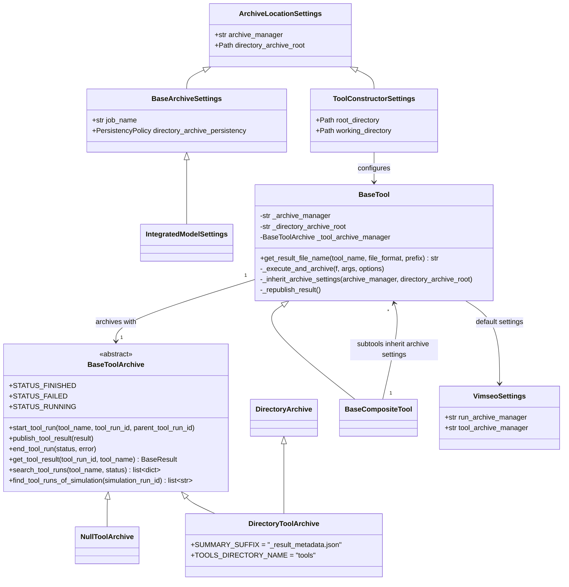

# Archive of the tool results in local directories

## Requirements

- Archive the result of every tool execution, as the simulations already are, so that
  a tool result can be found again from its `tool_run_id` or from a simulation it used.
- Make the archive searchable without opening any result file.
- Never lose a tool result because the archive failed.
- Let a composite tool and its subtools archive in the same place by default.
- Configure the archive of a tool with the same settings, under the same names, as the
  archive of a model, and keep apart, in the names and the docs, the archive of the
  results from the working directories of the tools (review feedback).
- Make clear, in the code and the examples, that opening an archive gives a manager to
  search and read the archive, not a result (review feedback).
- Create the working directory of a tool run only when something is written in it, so
  that a tool whose result is only archived leaves no empty directory, and the
  examples need not set `root_directory` (iteration 2).
- Out of scope: the MLflow backend (SPEC-005), loading a result from a URI (SPEC-007),
  the grouping of the tool runs by study (SPEC-011, which inserts `{study}/` above
  `tools/` in the layout below).

Acceptance criteria:

- Given a tool executed with the default configuration, then
  `default_archive/{study}/tools/{tool_name}/{tool_run_id}/` holds
  `{tool_name}_result.hdf5` and `{tool_name}_result_metadata.json` with
  `status: FINISHED` (`{study}` is `default_study` by default, SPEC-011).
- Given a tool which raises, then its summary has `status: FAILED` and the error
  message, and the error is raised to the caller.
- Given an archive that cannot be written, then the error is logged and the tool
  returns its result.
- Given a subtool created without archive settings, at any depth, then it archives
  where its top tool does; given a subtool with explicit settings, then it keeps them.
- Given `archive_manager="none"`, or `tool_archive_manager="none"` in the
  configuration, then nothing is written.
- Given any tool class, then its constructor accepts `archive_manager` and
  `directory_archive_root`, the names used by `IntegratedModelSettings`, with the same
  meaning and the same defaults; `archive_root` is no longer accepted.
- Given a tool and a model configured with the same `archive_manager` and
  `directory_archive_root`, then the tool results and the simulations are in the same
  archive.
- Given the docs of `BaseTool`, then `root_directory` is described as the root of the
  working directories of the tool (the counterpart of `directory_scratch_root` of a
  model), never as an archive.
- Given the examples and the docstring of `open_tool_archive`, then the returned object
  is named and described as the archive manager of the tool results, e.g.
  `tool_archive_manager`, never `tool_archive` alone nor `result`.
- Given a tool executed with the default settings which writes nothing (no
  `save_results`, no figure), then no working directory is created (iteration 2).
- Given a tool which writes a file (`save_results`, `plot_results`, a diagnostic
  figure), then its working directory is created at that moment, with the same name
  as today (`{root_directory}/{n}/`, `{n}` following the existing directories); given
  a composite tool, then the directory of a subtool is created under the one of its
  parent only when the subtool writes.
- Given the examples `13_tool_result_management/*`, then they do not set
  `root_directory`, and running them creates no directory in the current directory.

## Entities

## Approach

1. Archive interface:
   - `BaseToolArchive` defines the life cycle of a tool run (`start_tool_run`,
     `publish_tool_result` or `end_tool_run`) and the queries (`get_tool_result`,
     `search_tool_runs`, `find_tool_runs_of_simulation`). The methods are prefixed by
     `tool` because a backend may also archive simulations (MLflow, SPEC-005).
   - `NullToolArchive` archives nothing: the archive can be disabled without `if` in
     the tools.
   - `open_tool_archive(name, root)` selects the backend: `"DirectoryArchive"`,
     `"MlflowArchive"` (lazy import, SPEC-005), `"none"`. It *opens* rather than
     creates: existing runs are kept and searchable.
2. Directory backend:
   - `DirectoryToolArchive` derives from `DirectoryArchive` to reuse its job directory
     management: `{root}/{study}/tools/{tool_name}/{tool_run_id}/` (the `{study}`
     segment comes from SPEC-011).
   - The result is written with `BaseResult.to_hdf5`, under the same name as
     `BaseTool.save_results` (`get_result_file_name`), so that a file opened alone
     tells its tool.
   - A JSON summary (`create_summary`, `summary_to_json`) is written at start
     (`RUNNING`) and rewritten at the end (`FINISHED` or `FAILED`). It holds the
     status, date, VIMSEO version, settings, model, parent and children, simulations
     and key values; the searches only read summaries. Serializing the summary never
     fails (fallback to `repr`, SPEC-001).
3. Wiring in the tools:
   - `BaseTool` takes `archive_manager` and `archive_root` explicitly (not `**kwargs`),
     so that an unknown argument still raises a `TypeError`. Resolution:
     argument → `config.tool_archive_manager` → `config.run_archive_manager`; root:
     argument → `config.database.local_uri` → `default_archive/`.
   - `_execute_and_archive` is shared by `BaseTool.validate` and
     `BaseCompositeTool.validate`: start the run before executing the tool (so that
     simulations can be attached to it), archive the failure and re-raise, then set
     the options and identifiers on the result and publish it.
   - Every call to the archive goes through `_archive`, which logs and swallows the
     errors: a result which took hours must not be lost.
   - `_republish_result()` lets a tool which completes its result after `execute`
     (Bayesian analysis) publish it again.
4. Subtools:
   - `BaseCompositeTool` calls `_inherit_archive_settings` on its subtools after
     building them, recursively. An explicit setting of a subtool wins. The archive is
     reopened only when the resolved settings change.
   - `DeterministicValidationCase` now simulates through its `CustomDOETool` subtool,
     so that each simulation batch is archived as a child run (`cae11057`).
5. Configuration:
   - `archive_manager` of the configuration is renamed `run_archive_manager`,
     symmetric with the new `tool_archive_manager` (`77e8f3ff`). No alias.
   - The tests disable the archive with an autouse fixture in `tests/conftest.py`.
6. Settings symmetric with the models (review feedback):
   - The location of an archive is described once, by a new settings class
     `ArchiveLocationSettings` holding `archive_manager` and `directory_archive_root`.
     `BaseArchiveSettings` (hence `IntegratedModelSettings`) and
     `ToolConstructorSettings` both derive from it, so that a model and a tool are
     configured with the same names, descriptions and defaults, and cannot drift apart.
   - `archive_root` of the tools is renamed `directory_archive_root`: it is the name
     already used by the models and by the metadata of the simulations, which are more
     widely used than the tools. The settings proper to a simulation archive
     (`job_name`, `directory_archive_persistency`) stay in `BaseArchiveSettings`.
   - `root_directory` and `working_directory` of the tools are unchanged (public API
     older than this feature), but their descriptions say that they hold the working
     directories of the tool, the counterpart of `directory_scratch_root` of a model,
     and that the results are archived under `directory_archive_root`.
7. An archive manager, not a result (review feedback):
   - `open_tool_archive(name, root)` returns the *archive manager* of the tool
     results, the counterpart of `model.archive_manager` for the simulations: an object
     to search the tool runs and read their results. VIMSEO already calls this concept
     an archive manager (`BaseArchiveManager`, `model.archive_manager`), so the term
     "manager" is used rather than introducing "handler".
   - The returned object is named `tool_archive_manager` in the examples, the docs and
     the attributes of `BaseTool` (`_tool_archive` → `_tool_archive_manager`); the
     docstring of `open_tool_archive` says what it returns and that it is not a result.
8. Working directory created on demand (iteration 2):
   - The working directory (`root_directory`, `working_directory`) and the archive
     (`directory_archive_root`) have different roles: the first holds the files a tool
     run writes for the user (figures, diagnostics of a calibration, `save_results`),
     disposable and laid out per study tree; the second holds the result in a fixed,
     searchable layout, shared with the model, which may be an MLflow server where no
     file can be written. Both are kept.
   - Since the result is archived automatically, most tool runs write nothing in their
     working directory, but `_create_working_directory()` creates it at every
     `execute`: empty `{tool_name}/1/` directories accumulate in the current directory.
   - The name of the directory is *reserved* at the start of the execution, and the
     directory is created by the first access to the public property
     `working_directory`, which every writer already uses
     (`self.working_directory / file_name`). Accessing it means writing in it.
   - The internal accesses which only compute a path (the directory of a subtool under
     its parent) use a private property, which creates nothing.
9. Rejected alternatives:
   - Archiving the results in the model run archive: a tool run is not a simulation
     and has a different life cycle (children, failures without outputs).
   - Raising the archive errors: rejected for the reason above.
   - Renaming the model setting `directory_archive_root` to `archive_root`: it is also
     a metadata name of every archived simulation, renaming it would break the archives.
   - A new word "handler": a third name for the same concept as `archive_manager`.
   - Writing the working files in the archive and dropping `root_directory`: the
     archive layout would no longer be fixed, and an MLflow archive cannot hold them
     before an upload (iteration 2).
   - Creating the working directory with each writer (`mkdir` in `save_results`, in
     every post-tool): a dozen call sites, easy to forget in a new tool (iteration 2).

## Structure

### Inheritance Relationships

1. `NullToolArchive` and `DirectoryToolArchive` implement `BaseToolArchive`.
2. `DirectoryToolArchive` extends `DirectoryArchive`.
3. `BaseCompositeTool` extends `BaseTool` and overrides `_inherit_archive_settings`.
4. `BaseArchiveSettings` and `ToolConstructorSettings` extend `ArchiveLocationSettings`.

### Dependencies

1. `BaseTool.__init__` calls `_open_tool_archive` → `open_tool_archive`.
2. `BaseTool._execute_and_archive` calls `tool_run` (SPEC-003) and the archive.
3. `DirectoryToolArchive` calls `create_summary`, `summary_to_json`,
   `BaseTool.get_result_file_name`, `BaseTool.load_results`.
4. Every tool with its own constructor passes its options to `BaseTool.__init__`.

### Layered Architecture

1. `storage_management/tool_archive/`: the archives of the tool results, independent
   of any specific tool.
2. `tools/base_tool.py`, `tools/base_composite_tool.py`: the life cycle of a tool run.
3. `config/configuration_settings.py`: the default archive managers.

## Operations

### Create package - `vimseo/storage_management/tool_archive/`

1. `base_tool_archive.py`: `BaseToolArchive` (abstract, statuses as class
   attributes), `NullToolArchive`, `create_summary(tool_name, tool_run_id,
   parent_tool_run_id, status, result=None, error="")`, `summary_to_json(summary)`
   (retry with `skipkeys=True` on non-string keys).
2. `directory_tool_archive.py`: `DirectoryToolArchive(root_directory)`.
   - `start_tool_run`: job sub-path `{study}/tools/{tool_name}` (SPEC-011; it was
     the experiment `tools/{tool_name}` before), run name `tool_run_id`, create the job
     directory, write the `RUNNING` summary.
   - `publish_tool_result`: `to_hdf5`, then the `FINISHED` summary.
   - `end_tool_run`: summary with the status and the error.
   - `get_tool_result`: glob `{tool_name or *}/{tool_run_id}`; `KeyError` if absent or
     without result (message gives the status).
   - `search_tool_runs`: read every summary, filter by status, add `directory` and
     `uri`.
   - `find_tool_runs_of_simulation`: filter the summaries by `simulation_run_ids`.
3. `__init__.py`: `NO_TOOL_ARCHIVE = "none"`, `open_tool_archive(name, root)`;
   `ValueError` listing the available managers.

### Update tool - `BaseTool`

1. `ToolConstructorSettings`: add `archive_manager: str | None = None`,
   `archive_root: str | Path = ""`.
2. `__init__`: accept both, open the archive.
3. `_execute_and_archive`, `_archive`, `_republish_result`,
   `_inherit_archive_settings`, `_open_tool_archive` as described in Approach.
4. `get_result_file_name(tool_name, file_format="hdf5", prefix="")` →
   `{prefix}_{tool_name}_result.{file_format}`, used by `save_results`.

### Update tool - `BaseCompositeTool`

1. After `super().__init__`, make the subtools inherit the archive settings.
2. Use `_execute_and_archive` in `validate`.

### Update the tools with their own constructor

1. Verification tools, `DirectMeasures`, file readers: pass `**options` to the base
   constructor.

### Update configuration - `VimseoSettings`

1. Rename `archive_manager` → `run_archive_manager`; add
   `tool_archive_manager: str | None = None`.
2. Update `CHANGELOG.md`, `docs/user_guide/vimseo.env`, `docs/how_to/configuration.md`.

### Update tests

1. `tests/conftest.py`: autouse fixture setting `config.tool_archive_manager = "none"`.
2. `tests/storage_management/test_tool_archive.py`: life cycle, failure, search,
   nesting, explicit setting precedence, constructors of all tools.

### Iteration 1 (review feedback) - symmetric settings and archive manager naming

1. `vimseo/storage_management/archive_settings.py`: create `ArchiveLocationSettings`
   (deriving from `BaseSettings`) with the fields `archive_manager` and
   `directory_archive_root`, moved from `IntegratedModelSettings` and
   `BaseArchiveSettings` with their current descriptions and defaults; make
   `BaseArchiveSettings` derive from it.
   - The default of `archive_manager` stays resolved from the configuration
     (`run_archive_manager` for a model, `tool_archive_manager` then
     `run_archive_manager` for a tool): for the tools, the field default is `None`
     and `BaseTool._open_tool_archive` resolves it, as today.
2. `vimseo/tools/base_tool.py`: `ToolConstructorSettings` derives from
   `ArchiveLocationSettings`; the constructor argument `archive_root` becomes
   `directory_archive_root`; the attributes `_archive_root` → `_directory_archive_root`
   and `_tool_archive` → `_tool_archive_manager`; `_inherit_archive_settings` takes
   `directory_archive_root`. Rewrite the descriptions of `root_directory` and
   `working_directory`: "the root of the working directories of the tool runs", with a
   pointer to `directory_archive_root` for the archive.
3. `vimseo/tools/base_composite_tool.py` and every tool with its own constructor: pass
   `directory_archive_root` instead of `archive_root`.
4. `vimseo/storage_management/tool_archive/__init__.py`: docstring of
   `open_tool_archive`: "Returns: the archive manager of the tool results, to search
   the tool runs and read their results"; name its second argument
   `directory_archive_root`.
5. Examples `13_tool_result_management/*` and the docs: `archive_root` →
   `directory_archive_root`; the variable `tool_archive` → `tool_archive_manager`; one
   sentence stating that `root_directory` holds the working directories and
   `directory_archive_root` the archive, shared by the model and the tools.
6. Tests: replace `archive_root=` by `directory_archive_root=`; add a test that a tool
   and a model built with the same `ArchiveLocationSettings` values archive in the same
   root, and a test that `archive_root` raises a `TypeError`.
7. `CHANGELOG.md`: breaking change of the tool constructor argument.

### Iteration 2 - working directory created on demand

1. `vimseo/tools/base_tool.py`: a private class `_ReservingDirectoryCreator`
   deriving from GEMSEO's `DirectoryCreator`, with `reserve() -> Path` returning
   `root / self._generate_name()` without `mkdir` (the counter of a `NUMBERED` naming
   advances in memory; a reserved name never created is reused by a later process,
   which is harmless since the directory does not exist). It keeps its own `root`,
   the one of `DirectoryCreator` being name-mangled.
2. `BaseTool`:
   - `_create_working_directory()` → `_reserve_working_directory()`: sets
     `self._working_directory_path` to `self._directory_creator.reserve()` if
     `working_directory` is `""`, else to `Path(working_directory)`; creates nothing,
     logs nothing.
   - `_working_directory_path: Path | None` (private, no side effect).
   - Property `working_directory`: if a path is reserved, `mkdir(parents=True,
     exist_ok=True)` and log `Working directory is {path}` the first time; return the
     path. Before any execution, it returns `Path(self._working_directory)` as today.
   - The setter `working_directory` sets the user path and resets the reserved one.
   - `validate` calls `_reserve_working_directory()`.
   - `save_metadata_to_disk` (default path) uses the property `working_directory`
     instead of the raw string `self._working_directory`.
3. `vimseo/tools/base_composite_tool.py` `validate`: the path of a subtool is
   `self._working_directory_path / tool.name`, then `tool._reserve_working_directory()`;
   the property is not accessed, so the parent directory is not created.
4. Docstrings and descriptions of `root_directory` and `working_directory` (field and
   constructor): "created when the tool run first writes a file".
5. Examples `13_tool_result_management/*`: remove `root_directory` from the settings
   of the tools; replace the sentence on `root_directory` by two sentences on the two
   roles (the archive keeps the result, searchable and shared with the model; the
   files a tool writes for the user go to its working directory, created on demand,
   like the scratch of a model).
6. Tests (`tests/tools/test_base_tool.py` or a new `test_working_directory.py`,
   `fast`): a tool executed in `tmp_wd` with `archive_manager="none"` creates no
   directory; after `save_results()` the working directory exists and holds the HDF5;
   two executions writing a file give `1/` then `2/`; a composite tool creates
   `{n}/{subtool}/` only when the subtool writes; `tests/tools/test_bayes.py`
   (`working_directory.exists()` after access) stays green.
7. `CHANGELOG.md`: "A tool run no longer creates an empty working directory."

## Norms

1. The shared norms of `docs/specs/index.md`.
2. Every archive call from a tool goes through `BaseTool._archive`.
3. The result file name is built only by `BaseTool.get_result_file_name`.
4. A backend shipped by an extra is imported inside `open_tool_archive`, after
   `import_optional`.
5. A setting shared by the models and the tools is declared once, in a common settings
   class, never duplicated with another name.
6. The object returned by `open_tool_archive`, or `model.archive_manager`, is called an
   archive manager in the code and the docs; a variable holding it ends with
   `archive_manager`.

## Safeguards

1. Functional: an archive error never prevents the tool from returning its result.
2. Functional: a failing tool is archived as `FAILED` and the original exception is
   raised unchanged.
3. Functional: a run interrupted (killed process) stays `RUNNING`.
4. Integration: the archive is enabled by default, with the simulations' manager, in
   `default_archive/`.
5. Breaking change `77e8f3ff` (`refactor(config)!`): `VIMSEO_ARCHIVE_MANAGER` →
   `VIMSEO_RUN_ARCHIVE_MANAGER`. The old key in a `.env` file makes `VimseoSettings()`
   fail with a `ValidationError`; in the process environment it is silently ignored.
6. Breaking change: results can no longer be saved or loaded as pickle.
7. Tests: the default run must neither write in nor create the working directory
   (REQ-NFR-004, iteration 2).
8. Breaking change (iteration 1): the tool constructor argument `archive_root` is
   renamed `directory_archive_root`, without alias; it raises a `TypeError`. No release
   contains `archive_root` yet (the feature is not merged), so no deprecation period is
   needed; the commit is still marked `refactor!`.
9. Compatibility (iteration 1): `IntegratedModelSettings` keeps the same field names and
   defaults; the metadata `directory_archive_root` of the simulations is unchanged.

## Open questions

1. `DirectoryToolArchive` inherits many simulation methods of `DirectoryArchive` it does
   not use. Is composition preferable to inheritance?
2. `find_tool_runs_of_simulation` reads every summary: acceptable for thousands of
   runs, not beyond. Should an index be written?
3. The old `VIMSEO_ARCHIVE_MANAGER` environment variable is silently ignored. Should a
   warning be logged?
4. Should the archive be enabled by default, given that it writes in
   `default_archive/` of the current directory?
5. Should the classes be renamed too, for full symmetry with `BaseArchiveManager`
   (`BaseToolArchive` → `BaseToolArchiveManager`, `DirectoryToolArchive` →
   `DirectoryToolArchiveManager`, ...), or is naming the variables and documenting the
   return of `open_tool_archive` enough? The canvas only does the latter.
6. Should `root_directory` of the tools be renamed (e.g. `working_directory_root`) for
   symmetry with `directory_scratch_root`? It is an older public API, so the canvas only
   rewrites its description. Since iteration 2, the default run no longer needs it, so
   the renaming is less urgent; the question stays open.
7. Should the working directory of a tool run be created under the archive scratch of
   the study rather than under the current directory by default? Not in iteration 2.
