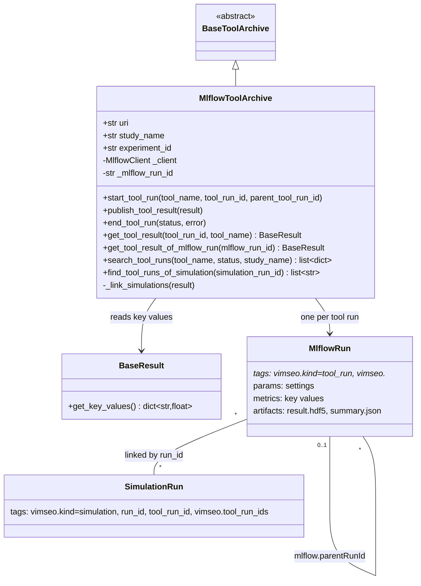

# Archive of the tool results in MLflow

## Requirements

- Archive the tool runs in MLflow, next to the simulations already archived there by
  `MlflowArchive`, so that the MLflow user interface shows, searches and compares the
  tool runs.
- Show the tree of the tool runs (subtools nested in their parent) and navigate
  between a tool run and its simulations, both ways.
- Expose the few numbers summarizing a result (key values) as MLflow metrics, to sort
  and filter the tool runs.
- Archive the tool runs of a study in the MLflow experiment of that study, next to its
  simulations, instead of a fixed experiment `tools` (iteration 1, SPEC-011).
- Out of scope: the `MlflowArchive` of the simulations (SPEC-002), the URI resolution
  (SPEC-007), the definition of the key values of each result class beyond
  `get_key_values` (SPEC-006).

Acceptance criteria:

- Given `archive_manager="MlflowArchive"`, when a tool runs, then the experiment of
  its study (SPEC-011) has an MLflow run named after the tool with the tags
  `vimseo.kind=tool_run`, `vimseo.study_name`, `vimseo.tool_name`,
  `vimseo.tool_run_id`, `vimseo.parent_tool_run_id`, `vimseo.vimseo_version`, the
  artifacts `{tool_name}_result.hdf5` and `{tool_name}_result_metadata.json`, the
  settings as params and the key values as metrics.
- Given a subtool, then its MLflow run has `mlflow.parentRunId` set to the run of its
  parent.
- Given a tool run using simulations archived in the same database, then the
  description of its run links to them, and each simulation has the tool run in its
  tag `vimseo.tool_run_ids`, even when read from the cache.
- Given a database without the experiment of a study, when searching, then no run is
  returned and no experiment is created.
- Given a tool run and its simulations in different studies, then they are linked in
  both ways (iteration 1).
- The behaviour tests of the archive pass on both backends.

## Entities

## Approach

1. Mapping a tool run to MLflow:
   - One MLflow run per tool run, in the experiment of its study (SPEC-011), next to
     the simulations of the study and told apart by the tag `vimseo.kind=tool_run`,
     named after the tool. Before iteration 1, the experiment was always `tools`.
   - Searchable fields are tags prefixed by `vimseo.`; the settings are params (so that
     MLflow compares runs); the key values are metrics; the result HDF5 and the JSON
     summary are artifacts, as in the directory archive.
   - The MLflow status of the run is the status of the tool run.
   - A subtool run is nested with the tag `mlflow.parentRunId`.
2. Isolation:
   - An `MlflowClient` bound to the tracking URI (`get_tracking_uri(root)`, shared with
     `MlflowArchive`): no global `mlflow.set_tracking_uri`, no active run (SPEC-002).
   - `mlflow` is imported in `open_tool_archive` after `import_optional` only.
3. MLflow limits:
   - Tags longer than 5000 characters (`simulation_run_ids`, `child_tool_run_ids`)
     are replaced by `in_artifact` and read back from the summary artifact.
   - Params are truncated to 1000 characters, and logged once (MLflow forbids
     changing them); an OpenTURNS distribution is shown by its short form.
   - Metric names are sanitized; metrics are logged in batches of 1000.
4. Links between tool runs and simulations:
   - The simulations (tag `vimseo.kind=simulation`) are searched in the experiment of
     the study of the tool run, else in all the experiments — a tool run may use,
     through the cache, simulations of another study. Before iteration 1, they were
     searched in the experiment `config.database.experiment_name` or
     `{model}_{load_case}`, else in all the experiments except `tools`.
   - Each simulation run gets the tool run in its tag `vimseo.tool_run_ids` (the most
     recent are kept if too long, with `vimseo.tool_run_ids_truncated`).
   - The description (`mlflow.note.content`) of the tool run links to its parent, its
     children, at most 50 simulations and a search of all of them.
   - Linking is a convenience: an error is logged, the result stays archived.
5. Key values:
   - `BaseResult.get_key_values()` returns the few scalars summarizing a result; each
     result class overrides it (validation and verification metrics, extrapolated
     values, Bayesian criteria and posterior means, surrogate qualities, calibrated
     parameters, statistics, number of DOE samples, sensitivity indices, metrics of
     each validation point). They go in the summary and are logged as metrics.
6. Rejected alternatives:
   - The fluent MLflow API (`mlflow.start_run`): it uses global state and a single
     active run, incompatible with nested tools and with the user's own runs.
   - Storing the settings only in the artifact: MLflow could not compare them.

## Structure

### Inheritance Relationships

1. `MlflowToolArchive` implements `BaseToolArchive`.
2. Each result class overrides `BaseResult.get_key_values`.

### Dependencies

1. `open_tool_archive("MlflowArchive", root)` → `MlflowToolArchive(root)`.
2. `MlflowToolArchive` uses `get_tracking_uri` (`mlflow_storage.py`), `create_summary`,
   `summary_to_json`, `_to_json_value`, `load_result_file`,
   `is_ot_distribution`.
3. `create_summary` calls `result.get_key_values()`.

### Layered Architecture

1. `storage_management/tool_archive/mlflow_tool_archive.py`: the backend, the only
   module importing `mlflow` for the tool results.
2. `tools/*/*_result.py`: the key values of each result.

## Operations

### Create backend - `MlflowToolArchive`

1. `__init__(root_directory="", study_name="")`: tracking URI, client; lazy
   `experiment_id` of the study (created on first write).
2. `_search_runs(filter_string, study_name=None)`: the experiment of the study, or all
   the experiments; always filtered by `vimseo.kind=tool_run`; return `[]` if the
   experiment does not exist; paginate by 1000.
3. `start_tool_run`: tags, `mlflow.parentRunId` from the parent's run if found,
   `create_run`.
4. `publish_tool_result`: summary; artifacts in a temporary directory; tags
   (`result_class`, `model`, `load_case`, identifier lists or `in_artifact`); metrics by
   batches; params if none yet; `set_terminated(FINISHED)`; `_link_simulations` in a
   `try`.
5. `end_tool_run(status, error)`: tag `vimseo.error` (5000 characters max),
   `set_terminated(status)`.
6. `get_tool_result`, `get_tool_result_of_mlflow_run`: `KeyError` with a clear message
   if no run or no artifact.
7. `search_tool_runs`: summaries rebuilt from tags, params, metrics (and the summary
   artifact for `in_artifact` lists), with `mlflow_run_id` and `uri = runs:/{id}`.
8. `find_tool_runs_of_simulation`: filter the summaries.

### Update - `open_tool_archive`

1. Branch `ArchiveManager.Mlflow`: `import_optional("mlflow", ...)`, then import the
   backend.

### Add key values - `BaseResult.get_key_values` and overrides

1. `BaseResult.get_key_values() -> dict[str, float]`, empty by default.
2. Overrides in the results of verification, solution verification, validation point,
   validation case, Bayesian analysis, calibration step, surrogate, statistics, DOE,
   sensitivity.
3. `create_summary` writes them under `key_values`.

### Update tests

1. Parametrize the behaviour tests of `tests/storage_management/test_tool_archive.py`
   on both backends; add the nesting, linking, no-experiment and metrics tests.

### Iteration 1 - the tool runs in the experiment of their study (SPEC-011)

The operations are specified in SPEC-011 ("Update tool archives",
`mlflow_tool_archive.py`); in short:

1. Remove `EXPERIMENT_NAME`; `experiment_id` is the one of the experiment of the study.
2. `start_tool_run` adds the tags `vimseo.kind=tool_run` and `vimseo.study_name`.
3. `_find_run`, `get_tool_result`, `find_tool_runs_of_simulation` search all the
   experiments; `search_tool_runs(..., study_name="")` all of them or one study.
4. `_get_simulation_experiment_ids` no longer reads `config.database.experiment_name`.
5. Tests: the experiment `tools` of `test_tool_archive.py` becomes the experiment of
   the study; add the cross-study linking test.

## Norms

1. The shared norms of `docs/specs/index.md`.
2. Only `MlflowClient` with an explicit tracking URI; never the fluent API.
3. Every VIMSEO tag is built by `_tag(name)` (`vimseo.` prefix).
4. Every MLflow limit is a module constant (`_MAX_TAG_LENGTH`, `_MAX_PARAM_LENGTH`,
   `_MAX_SIMULATION_LINKS`, `_MAX_METRICS_PER_BATCH`).

## Safeguards

1. Functional: searching never creates an experiment.
2. Functional: a result published again replaces its artifacts and keeps its first
   params.
3. Functional: a linking error does not fail the publication.
4. Integration: without the `mlflow` extra, `MlflowArchive` raises an error naming the
   extra; the directory backend works.
5. Performance: linking scans the runs of the simulation experiments (all of them for
   a tool without model) at each publication.
6. Tests: `tests/storage_management/test_tool_archive.py` on both backends.

## Open questions

1. `_get_simulation_runs` scans every run of the experiments to match the `run_id`
   tags. Should it use an MLflow filter (`tags.run_id IN (...)`) by chunks, for large
   databases?
2. `_add_tool_run_to_simulation` reads, modifies and rewrites a tag: two tool runs
   running at the same time can lose a link. Is it acceptable?
3. The search link uses `LIKE '%{tool_run_id}%'` on a JSON list: correct for UUIDs, but
   is a dedicated tag per tool run cleaner?
4. Which key values should each result expose? The current choice is per result
   class and not documented in one place.
