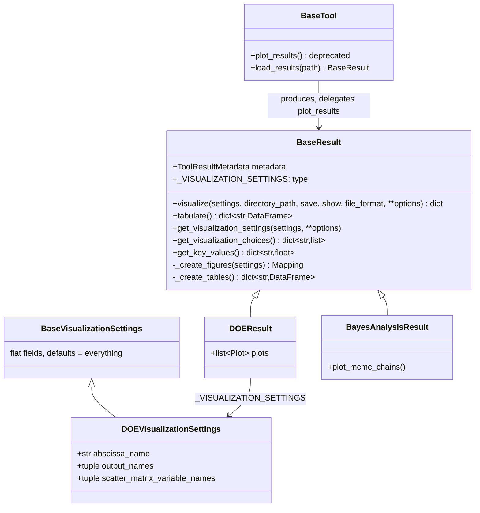

# Visualize and tabulate a tool result without its tool

## Requirements

- Let anyone explore a tool result — figures and numerical tables — from the result
  alone, e.g. loaded from a file or an archive, without the tool nor the model which
  produced it.
- Show everything by default; let the settings narrow the selection.
- Export the figures as static images for reports.
- Out of scope: finding a result from a URI and the command line (SPEC-007); the key
  values logged as metrics (SPEC-005).

Acceptance criteria:

- Given any result class, when `result.visualize()` is called with no setting, then it
  returns all its figures as a flat `dict[str, Figure]` (Plotly or matplotlib), with
  no side effect on disk unless `save=True`.
- Given `result.tabulate()`, then it returns `dict[str, DataFrame]`, with a `settings`
  table when the tool had settings.
- Given a setting which is not a field of the visualization settings of the result,
  then a validation error is raised.
- Given `save=True, file_format="png"`, then the Plotly figures are written as PNG,
  on Linux and on Windows.
- Given a result of a Bayesian analysis whose chains are sampled, then
  `visualize()` shows the MCMC chains.
- Given a DOE varying a single input, then `visualize()` shows the scalar outputs
  versus this input and the curves of the model `PLOTS` superposed for all samples.
- Given `BaseTool.plot_results(...)`, then a `DeprecationWarning` is emitted and the
  figures of `visualize()` are returned.

## Entities

Other result classes with their own figures and settings: verification,
solution verification, validation point, validation case, calibration step,
sensitivity, statistics, surrogate, space tool.

## Approach

1. Template method on `BaseResult`:
   - `visualize()` validates the settings, calls `_create_figures(settings)`, flattens
     nested mappings into keys joined by `_`, then optionally saves and shows.
   - `tabulate()` calls `_create_tables()` (by default, tabular fields give one table
     each and scalars are gathered in `scalars`) and adds the `settings` table.
   - Each result class declares `_VISUALIZATION_SETTINGS` and overrides
     `_create_figures`, and `_create_tables` if needed.
2. Settings:
   - Flat fields only (numbers, strings, booleans, enums, tuples of strings), each with
     a default meaning *all*, so that a user interface or a command line can build
     them generically.
   - `get_visualization_choices()` lists the names available for the selection
     settings (e.g. the variables of the DOE scatter matrix), for user interfaces.
3. Plotters without side effects:
   - The existing `Plotter` tools are run by `create_figure` in a temporary directory,
     with `archive_manager="none"`, without saving nor showing.
4. Migration from the tools:
   - The `plot_results` overrides of the tools move to `_create_figures` of their
     results. `BaseTool.plot_results` is deprecated and delegates to `visualize()`,
     mapping the old singular options (`output_name`) to the plural settings.
   - The Bayesian post-processing is stored in the result (`metadata.misc["post"]`,
     observed data, free parameter names) and the result is published again in the
     archive (`_republish_result`).
   - The DOE result stores the figures of the model (`DOEResult.plots`, from
     `IntegratedModel.plots`): the model description no longer holds them since
     upstream `3fa371bb` removed `ModelDescription.plots`.
5. Loading without knowing the class: `load_result_file()` and
   `load_result_buffer()` read the class from the HDF5 attributes.
6. Static export: `kaleido` (0.2.1; 0.1.0.post1 on Windows, where 0.2.1 hangs), as
   kaleido ≥ 1 needs plotly ≥ 6.1.
7. Rejected alternatives:
   - Keeping the plots in the tools: a result could not be visualized after loading.
   - Nested visualization settings: they cannot be built generically by a CLI or a
     dashboard.

## Structure

### Inheritance Relationships

1. Every result class extends `BaseResult` and may define a settings class extending
   `BaseVisualizationSettings`.

### Dependencies

1. `BaseResult` → `result_visualization` (`flatten_figures`, `save_figures`,
   `show_figures`, `fields_to_dataframes`, `settings_to_dataframe`).
2. Result classes → `create_figure` → `Plotter` tools.
3. `BaseTool.plot_results`, `BaseTool.load_results` → `BaseResult.visualize`,
   `load_result_file`.

### Layered Architecture

1. `tools/base_result.py`: the contract.
2. `tools/result_visualization.py`: generic helpers for figures and tables.
3. `tools/*/*_result.py`, `tools/doe/doe_plots.py`: the figures of each tool.

## Operations

### Update - `BaseResult`

1. Add `_VISUALIZATION_SETTINGS`, `visualize`, `get_visualization_settings`,
   `get_visualization_choices`, `_create_figures`, `tabulate`, `_create_tables`.

### Create - `vimseo/tools/result_visualization.py`

1. `BaseVisualizationSettings`, `KEY_SEPARATOR`, `flatten_figures`, `get_file_stem`,
   `save_figures` (matplotlib in PNG when the format is HTML), `show_figures`,
   `create_figure`, and the table helpers (`to_cell`, `mapping_to_dataframe`,
   `value_to_dataframe`, `fields_to_dataframes`, `settings_to_dataframe`).

### Move figures to results

1. For each tool overriding `plot_results`: create or extend its result class with a
   settings class and `_create_figures`; delete the override from the tool; update its
   examples.
2. `BayesAnalysisResult`: `plot_mcmc_chains`, posterior and predictive plots; remove
   `BayesTool.plot_burnin`, `plot_posterior_distribution`,
   `plot_predictive_distribution`.
3. `DOEResult`: store the model description and the figures of the model
   (`plots`, set by `DOETool` and `CustomDOETool`); scatter matrix with
   `scatter_matrix_variable_names`; parametric study when a single input varies
   (`doe_plots.py`).

### Update - `BaseTool`

1. Deprecate `plot_results`; drop the pickle format; `load_results` uses
   `load_result_file`.

### Create - `tool_results_factory.load_result_file`, `load_result_buffer`

### Update dependencies

1. `pyproject.toml`: `kaleido` with platform markers.

### Tests

1. `tests/tools/test_result_visualization.py`, and per tool (`test_doe.py`,
   `test_bayes.py`, ...): default visualization of each result, settings validation,
   tables, image export.

## Norms

1. The shared norms of `docs/specs/index.md`.
2. A result never needs its tool to be visualized: no reference to a tool instance in
   `_create_figures`.
3. Visualization settings are flat, and default to "everything".
4. Figure keys are stable: they are the file names of the saved figures.

## Safeguards

1. Functional: `visualize()` without `save`/`show` has no side effect on disk.
2. Functional: creating a figure never archives a tool run.
3. Breaking changes `84fd388c` (`feat(results)!`): the keys and file names of the
   figures change; the pickle format is removed; `ModelResult` of `model_tool` is
   renamed `ModelCreationResult`.
4. Breaking change `7aa06e0c` (`feat(bayes)!`): `BayesTool.plot_burnin`,
   `plot_posterior_distribution`, `plot_predictive_distribution` are removed; use the
   methods of the result.
5. Platform: the image export works on Windows with kaleido 0.1.0.post1.
6. Tests: every result class is visualized with default settings.

## Open questions

1. `kaleido` is a **mandatory** dependency, while REQ-DEP-001 asks for an install
   without a graphical stack. Should it move to an extra (e.g. `export`)?
2. When will `BaseTool.plot_results` be removed?
3. Should the figure keys be documented as a stable interface, since they are file
   names?
