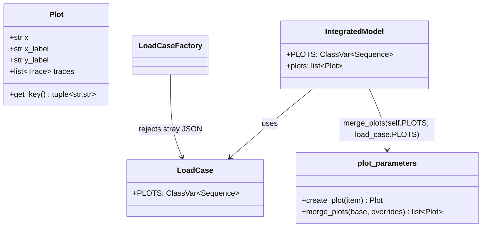

# Plots declared by the load cases as a PLOTS class attribute

## Requirements

- Declare the figures of a load case in code, next to the load case, like the figures
  of a model (`IntegratedModel.PLOTS`), instead of in a JSON file beside it.
- Let a load case replace a figure of its model or add its own.
- Let the abscissa of a figure have a custom label.
- Fail loudly on a load case still using the JSON convention.

Acceptance criteria:

- Given a model `PLOTS` and a load case `PLOTS` entry with the same abscissa and first
  ordinate, then `model.plots` holds the load case entry at the model entry's position.
- Given a load case entry with a new key, then it is appended after the model entries.
- Given a stray `{LoadCaseClassName}.json` next to a load case, then the load case
  factory raises a `ValueError` with a migration message.
- Given `Plot(x=..., x_label="Displacement")`, then the abscissa title is
  `Displacement`.

## Entities

## Approach

1. Same declaration for models and load cases: `PLOTS`, a sequence of tuples of
   variable names (abscissa first) or `Plot` objects, normalized by `create_plot`.
2. Merge rule: a plot is identified by `Plot.get_key()` = (abscissa, first ordinate).
   `merge_plots(base, overrides)` keeps the order of `base`, replaces matching
   entries in place and appends the others.
3. Migration: `PlotParameters`, `LoadCase.plot_parameters` and
   `get_plot_parameters()` are deleted; the factory rejects any stray JSON file so
   that plugins (e.g. vimseo-composites) are migrated knowingly.
4. `x_label` mirrors `y_label` on `Plot`. `MockMultiCurves` is fixed so that its
   reference line has the unit of its axis (`critical_energy` →
   `critical_crack_position`).
5. Rejected alternative: keeping the JSON files — not checked by the tests nor by the
   type checker, and separated from the code they describe.

## Structure

### Inheritance Relationships

1. Concrete load cases extend `LoadCase` and may override `PLOTS`.

### Dependencies

1. `IntegratedModel.plots` → `merge_plots(self.PLOTS, self._load_case.PLOTS)`.
2. `LoadCaseFactory` checks for stray JSON files.

### Layered Architecture

1. `core/load_case.py`, `core/load_case_factory.py`, `core/base_integrated_model.py`.
2. `tools/post_tools/plot_parameters.py`: `Plot`, `create_plot`, `merge_plots`.

## Operations

### Update - `plot_parameters.py`

1. Add `Plot.x_label`, `Plot.get_key()`, `merge_plots(base, overrides)`; delete
   `PlotParameters`.

### Update - `LoadCase` and `LoadCaseFactory`

1. Replace the `plot_parameters` field with `PLOTS: ClassVar[...] = []`; delete
   `get_plot_parameters()`.
2. Remove the JSON loading; raise `ValueError` with a migration message on a stray
   `{ClassName}.json`.

### Update - `IntegratedModel`

1. `plots` uses `merge_plots`; document the override rule in the `PLOTS` docstring.

### Migrate the problems

1. `LC2.json` → `LC2.PLOTS`; `tan_oht.py` `CURVES` → `PLOTS`; add `DummyOverride` and
   `MockCurvesOverride` fixtures; fix `MockMultiCurves`.

### Tests

1. `tests/tools/post_tools/test_plot_parameters.py`, `tests/core/test_load_case.py`
   (stray JSON), `tests/tools/plotting/test_plot_model.py` (override).
2. Drop `test_load_case_factory_rejects_legacy_curves_key`, made obsolete (`0ebfc5e1`).

## Norms

1. The shared norms of `docs/specs/index.md`.
2. Figures of models and load cases are declared only through `PLOTS`.

## Safeguards

1. Breaking change: a load case using a JSON file for its plots now fails at
   creation; it must declare `PLOTS`.
2. Functional: the order of the model figures is preserved.
3. Tests: listed above.

## Open questions

1. `081732fa` is not marked as breaking (`!`) although it removes `plot_parameters`
   and rejects the JSON files. Should the changelog say so explicitly?
2. Two model entries with the same key are silently merged into one by
   `merge_plots`. Should it raise?
