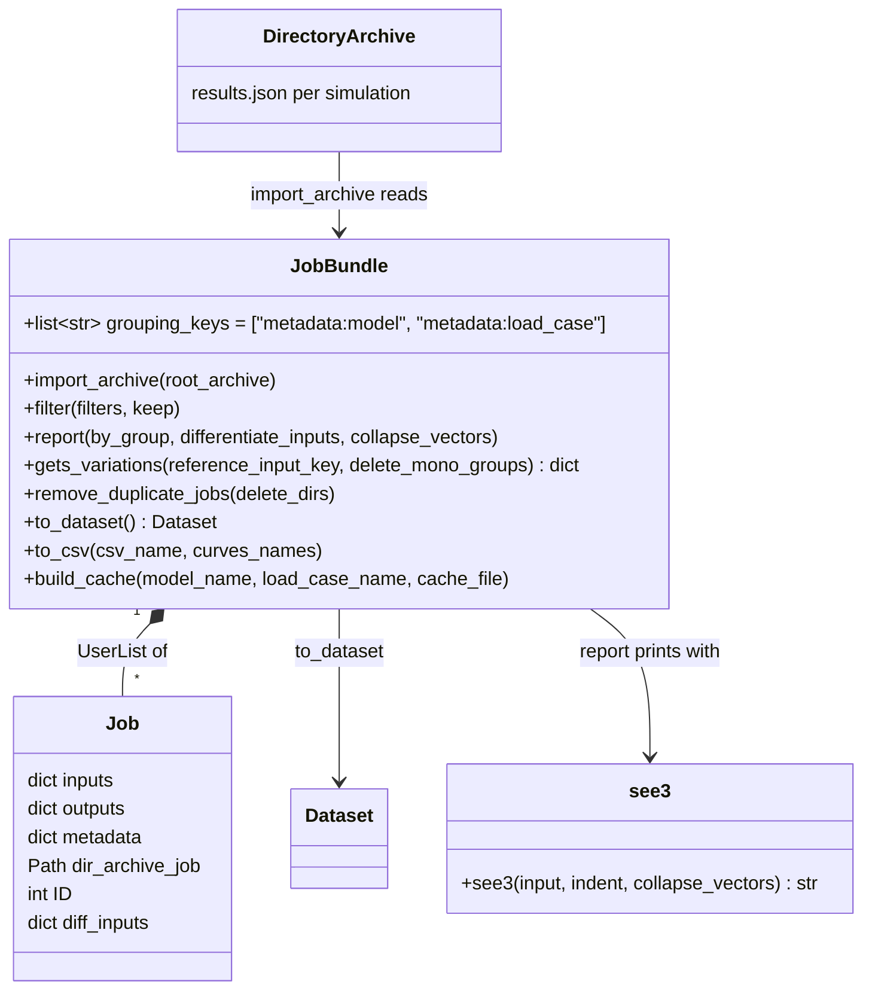

# JobBundle, an explorer of the archived simulations

## Requirements

- Let an analyst explore all the simulations of a directory archive at once, without
  creating any model: load them, narrow them down, see what differs between them, and
  turn them into tables or datasets for post-processing.
- Make the simulations comparable by showing only what varies between them (the
  differentiating inputs), and by finding the families of simulations which vary along
  a single input (parametric studies).
- Purpose of this retro-specification: describe the existing behaviour, which is
  untested and used nowhere in VIMSEO, and extract the interaction ideas worth reusing
  to simplify the data roundtrip of the model results and the tool results
  (SPEC-007, SPEC-010). Changing `JobBundle` itself is out of scope.

Acceptance criteria (current behaviour):

- Given a directory archive, when `JobBundle(root)` is created, then it holds one item
  per `results.json` found recursively under `root`, each item being the content of the
  file plus `dir_archive_job` (its directory) and `ID` (an integer unique in the
  bundle); vector inputs are converted to tuples so that they can be compared.
- Given `bundle.filter({"inputs:height": 50.0})`, then only the simulations whose input
  `height` equals 50 remain; with `keep=False`, they are removed instead.
- Given `bundle.report(by_group=True, differentiate_inputs=True)`, then the simulations
  are printed in a tree grouped by model then load case, showing only the inputs which
  differ between them.
- Given `bundle.gets_variations("height")`, then the simulations are grouped by equal
  values of all their inputs except `height`, the groups of one simulation are dropped,
  and each simulation gets `diff_inputs`, the inputs differentiating its group from the
  others.
- Given `bundle.remove_duplicate_jobs(delete_dirs=True)`, then the simulations with the
  same inputs as an earlier one are removed from the bundle and their archive
  directories are deleted.
- Given a bundle of one model and load case with scalar inputs, then `to_dataset()`
  returns a GEMSEO `Dataset` with the groups `inputs` and `outputs`; `to_csv(name)`
  writes the differentiated inputs and the curves side by side.

## Entities

## Approach

1. Data model:
   - A bundle is a `UserList` of plain dictionaries, one per simulation, as written by
     `DirectoryArchive` (`inputs`, `outputs`, `metadata`), enriched with `ID` and
     `dir_archive_job`. No class per simulation: the user indexes the dictionaries.
   - Keys are addressed with a namespace, `"group:name"` (e.g. `"inputs:layup"`,
     `"metadata:model"`), parsed by `_split_namespace`; one string designates any
     input, output or metadata.
2. Interaction style:
   - One object, created from the root of the archive, then refined in place by verbs
     (`filter`, `remove_duplicate_jobs`) and read by views (`report`,
     `gets_variations`, `to_dataset`, `to_csv`). The user never handles run
     identifiers, experiments nor archive managers.
   - Views focus on differences: `_differentiate_list` keeps only the inputs taking
     several values; `gets_variations` hashes the inputs except one to find parametric
     families.
   - The grouping keys (`grouping_keys`) organize the report as a tree.
3. Limits of the current design (observed in the code):
   - Directory archives only; MLflow archives and tool results are not supported.
   - The verbs mutate the bundle (`filter`, `remove_duplicate_jobs`), and
     `report(collapse_vectors=True)` collapses the output vectors of the data itself
     (acknowledged by a TODO).
   - `report(by_group=False)` calls itself with the (non-empty) list as `by_group`, so it
     prints the grouped report instead, and drops `differentiate_inputs`: the
     non-grouped report is never produced.
   - `to_dataset` reports the wrong job in an error message (loop variable), supports
     only scalar inputs except the special case `layup`.
   - `build_cache` raises `NotImplementedError` (replaced by
     `IntegratedModel.create_cache_from_archive`); its body is dead code.
   - Output is printed (`print`) rather than returned or logged.
4. Ideas worth reusing for the data roundtrip (input of SPEC-010):
   - **One entry point from a location**: open "the results under this root" and get a
     collection, without choosing an API per backend or per kind of result.
   - **A collection with verbs**: filter by values with a single key syntax, remove
     duplicates, group, then export to a `Dataset`, a `DataFrame` or CSV. The model
     results of a tool run (`simulation_run_ids`) and the runs of a search would be
     such collections.
   - **Show what differs**: a report of the differentiating inputs, and the detection
     of parametric families, which matches the parametric study of a DOE (SPEC-006).
   - **Namespaced keys** `"inputs:x"`, `"outputs:y"`, `"metadata:model"`, consistent
     with the groups of an `IODataset`.
   - Not to reuse: mutation in place, printing instead of returning, plain
     dictionaries instead of `ModelResult`.

## Structure

### Inheritance Relationships

1. `JobBundle` extends `collections.UserList`.

### Dependencies

1. `JobBundle.import_archive` reads the `results.json` files written by
   `DirectoryArchive` (`_RESULTS_JSON_FILE`).
2. `JobBundle.to_dataset` uses `gemseo.datasets.dataset.Dataset.from_array` and
   `vimseo.utilities.datasets.encode_vector`.
3. `JobBundle.report` uses the module function `see3`.
4. Nothing in VIMSEO imports `JobBundle`; there is no test.

### Layered Architecture

1. `utilities/sandbox/`: experimental helpers, outside the public API.
2. `storage_management/`: the archives whose files `JobBundle` reads directly, bypassing
   their managers.

## Operations

### Document the existing module - `vimseo/utilities/sandbox/job_bundle.py`

1. `JobBundle(root_archive=None)`: if given, call `import_archive(root_archive)`.
2. `import_archive(root_archive)`: `ValueError` if not a directory; walk the tree, load
   every `results.json`, add `dir_archive_job` and `ID` (continuing the IDs already in
   the bundle), convert vector inputs to tuples, extend the bundle, check the structure
   (`inputs`, `outputs`, `metadata` in every item).
3. `filter(filters, keep=True)`: for each item and each `"group:name": value`, remove
   the item when the equality does not match `keep`.
4. `gets_variations(reference_input_key, delete_mono_groups=True)`: group the items by
   the SHA-256 of their inputs without `reference_input_key`; drop the groups of one item
   if asked; set `diff_inputs` on copies of the items; return the groups by hash.
5. `remove_duplicate_jobs(delete_dirs=False)`: remove the later items with the same
   inputs as an earlier one; delete their archive directory if asked.
6. `report(by_group, differentiate_inputs, collapse_vectors)`: print the tree grouped by
   `grouping_keys`, each leaf printed by `see3`, with the differentiated inputs only if
   asked.
7. `to_dataset()`: check one model and load case, rectangular data and scalar inputs;
   encode `layup`; build a `Dataset` with the groups `inputs` and `outputs`.
8. `to_csv(csv_name, curves_names=())`: one block of columns per simulation: its
   differentiated inputs as header, its fields, then its curves (outputs with more than
   5 values by default).
9. `build_cache(...)`: deprecated, raises `NotImplementedError`.

### Record the defects (no code change in this canvas)

1. Non-grouped `report` falling back to the grouped one; `to_dataset` error message
   variable; mutation by
   `collapse_vectors`; dead body of `build_cache`. They are fixed only if `JobBundle` is
   kept (see Open questions).

## Norms

1. The shared norms of `docs/specs/index.md`.
2. Sandbox code is not part of the public API: nothing outside `utilities/sandbox/`
   depends on it, and examples do not use it.
3. An idea taken from `JobBundle` into the public API (SPEC-010) is re-implemented on
   `ModelResult`, `BaseResult` and the archive managers, with tests, not imported from
   the sandbox.

## Safeguards

1. Functional: `remove_duplicate_jobs(delete_dirs=True)` deletes archive directories:
   irreversible.
2. Integration: only directory archives; any change of the layout or of the file name
   of `DirectoryArchive` breaks `import_archive` silently (no test).
3. Technical: no test covers the module; its behaviour above is read from the code.
4. Compatibility: retro-specification only, no code change.

## Open questions

1. Keep `JobBundle` (fix its defects, add tests, support `ModelResult` and MLflow), or
   remove it once SPEC-010 provides a public collection of results with the same verbs?
   The recommendation is to remove it after SPEC-010.
2. Which views are worth making public first: the differentiated inputs, the parametric
   families, or the export to `Dataset`?
3. Should the namespaced keys `"inputs:x"` become the selection syntax of the public
   API, or should it use separate `input_names` / `output_names` arguments as the tools
   do?
