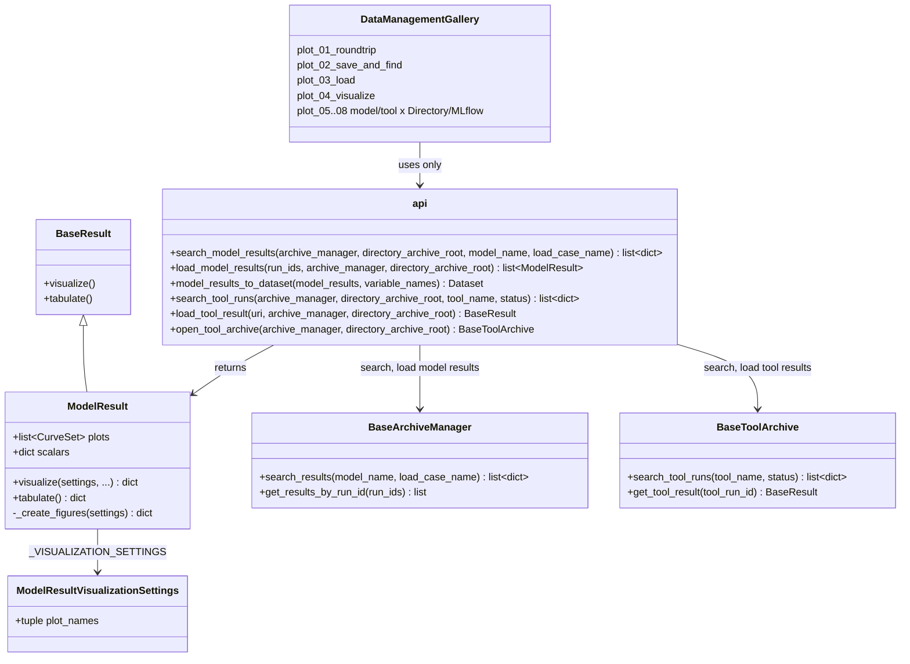

# Data management examples and a symmetric roundtrip of the results

## Requirements

- Teach the roundtrip of the results — generate, save, load, visualize — in a dedicated,
  progressive gallery, from a stripped-down usage example to the backend details, for
  the model results and the tool results.
- Make the roundtrip read the same for a model result and a tool result, and for the
  Directory and MLflow archives: same verbs, same archive settings, same
  `result.visualize()`, so that the user learns one pattern instead of eight.
- Analysis: `spdd/analysis/SPEC-010-202610091207-[Analysis]-data-management-examples-and-roundtrip.md`.
  Decisions taken with the reviewer: the 3 basic examples are split by verb; the API
  simplification is limited to symmetry (no facade class).
- Out of scope: a facade class or a collection with filter/diff verbs (SPEC-009 open
  question), a single `vimseo` CLI, changes of the archive formats.

Acceptance criteria:

- Given the doc, then a gallery folder `docs/runnable_examples/14_data_management/` holds,
  in this order: `plot_01_roundtrip` (stripped-down roundtrip and the API table),
  `plot_02_save_and_find`, `plot_03_load`, `plot_04_visualize`,
  `plot_05_model_results_in_directories`, `plot_06_model_results_in_mlflow`,
  `plot_07_tool_results_in_directories`, `plot_08_tool_results_in_mlflow`; the former
  `02_integrated_models/plot_03_model_result_management.py` and
  `13_tool_result_management/` no longer exist.
- Given `plot_01_roundtrip`, then it has no more than about 60 lines of code, uses only
  `vimseo.api` functions and the objects they return, and shows a table whose rows are
  the verbs and whose columns are model results and tool results, with a note that only
  `archive_manager` changes between Directory and MLflow.
- Given a `ModelResult` loaded from an archive, when `model_result.visualize()` is
  called, then it returns the figures of its `PLOTS` without the model instance; a
  result without plots returns no figure without failing.
- Given `vimseo.api`, then it provides, with the archive arguments `archive_manager`,
  `directory_archive_root` (SPEC-004):
  `search_model_results`, `load_model_results`, `search_tool_runs`, `load_tool_result`,
  `open_tool_archive`, and `model_results_to_dataset`.
- Given the examples, then every variable holding `ModelResult` objects is named
  `model_results` (or `model_result`), every variable holding raw archive dicts is named
  `archived_data`, and the archive manager of the tools is `tool_archive_manager`.
- Given `plot_03_load` and `plot_07`/`plot_08`, then `tool_archive_manager.get_tool_result(tool_run_id)`
  and `load_tool_result(uri)` are shown in the same cell, as the two ways to load a tool
  result.
- Given the core profile (no `mlflow` extra), then the doc build skips `plot_06` and
  `plot_08` cleanly, and the other examples run.

## Entities

## Approach

1. One pattern, two kinds of results:
   - The roundtrip table of `plot_01` is the specification of the API:

     | Verb | Model results | Tool results |
     |---|---|---|
     | Choose where | `IntegratedModelSettings(archive_manager=..., directory_archive_root=...)` | `Tool(archive_manager=..., directory_archive_root=...)` |
     | Generate and save | `model.execute(...)`, archived automatically | `tool.execute(...)`, archived automatically |
     | Find | `search_model_results(...)` | `search_tool_runs(...)` |
     | Load | `load_model_results(run_ids, ...)` | `load_tool_result(uri, ...)` |
     | Visualize | `model_result.visualize()` | `tool_result.visualize()`, `visualize_tool_result` CLI |
     | Tabulate | `model_results_to_dataset(model_results)`, `model_result.tabulate()` | `tool_result.tabulate()` |
     | Explore | `dashboard_database_viewer`, `dashboard_mlflow` | `dashboard_mlflow`, `visualize_tool_result` |

     Directory and MLflow differ only by `archive_manager`: a cell needing a backend-specific
     function is a defect of the API.
   - The functions are flat functions of `vimseo.api` (REQ-UX-001), lazily importing
     the archives, with the archive arguments of SPEC-004 in the same order.
2. Model results draw themselves:
   - `ModelResult` already stores its figures (`plots`, `CurveSet` with their `Plot`),
     filled by `ModelResult.from_data`. It gains `_create_figures`, drawing each curve set
     with `superpose_curves` as `IntegratedModel._plot_curves` does, and a flat settings
     class `ModelResultVisualizationSettings` (`plot_names`, default all).
   - `IntegratedModel.plot_results` (data `"PLOTS"`) delegates to
     `ModelResult.visualize`, so that the model and the result draw the same figures.
3. Finding model results without the model and without the MLflow API:
   - `BaseArchiveManager.search_results(model_name="", load_case_name="")` returns one
     summary per archived simulation (`run_id`, `model`, `load_case`, `tool_run_id`,
     `datetime`, `uri`), from the `results.json` metadata (Directory) or the tags
     (MLflow), searching the whole archive as `get_results_by_run_id` does.
   - `vimseo.api.search_model_results` opens the archive from its settings and calls it;
     `search_tool_runs` does the same with `open_tool_archive(...).search_tool_runs`.
4. Tabular export (idea of `JobBundle.to_dataset`, SPEC-009):
   - `model_results_to_dataset(model_results, variable_names=())` builds an `IODataset`
     of the scalars of the model results (inputs and outputs groups), one row per
     simulation, using `vimseo.utilities.datasets.to_dataset`.
5. The gallery:
   - One folder `14_data_management` (the gallery discovers one level only,
     `docs/gallery_conf.py`), numbered files for the reading order, a `README.md`
     presenting the path: roundtrip → by verb → by backend and kind of result.
   - `plot_01_roundtrip`: one model, one tool (a small DOE), Directory archive; generate,
     find, load, visualize both kinds; the table; one sentence per concept, no internals.
   - `plot_02_save_and_find`: where results go (`archive_manager`,
     `directory_archive_root` and `study_name`, shared by the model and the tools,
     SPEC-011), automatic saving, `search_model_results`, `search_tool_runs` with and
     without `study_name`. `root_directory` is not shown: the working directory is
     created only when a tool writes a file (SPEC-004 iteration 2).
   - `plot_03_load`: `load_model_results`, `load_tool_result` by URI next to
     `tool_archive_manager.get_tool_result(tool_run_id)`, and from a tool result to its
     model results through `metadata.simulation_run_ids`.
   - `plot_04_visualize`: `visualize()` and `tabulate()` of both kinds, settings, image
     export, the CLI `visualize_tool_result` and the dashboards, in one table "need →
     command".
   - `plot_05`–`plot_08`: the content of the current `plot_03_model_result_management.py`
     (split into Directory and MLflow) and of `13_tool_result_management/`
     (`plot_01`, `plot_02`), rewritten with the API above and the naming of SPEC-004 and
     SPEC-007; the internals (job directory table, MLflow tags mapping, tool run tree,
     links between tool runs and simulations) live here.
6. Rejected alternatives:
   - A generic `load_result(uri)` returning either kind: hides what is returned.
   - A facade class (`ResultStore`) or a public `JobBundle`: a third vocabulary, out of
     scope by decision of the reviewer.
   - Keeping the examples in place: the reviewer asked for a dedicated, progressive
     folder.

## Structure

### Inheritance Relationships

1. `ModelResult` extends `BaseResult` and overrides `_create_figures`; its settings class
   extends `BaseVisualizationSettings`.
2. `DirectoryArchive` and `MlflowArchive` implement `BaseArchiveManager.search_results`.

### Dependencies

1. `vimseo.api.search_model_results`, `load_model_results` → `get_archive_class` →
   `BaseArchiveManager.search_results`, `get_results_by_run_id` → `ModelResult.from_data`.
2. `vimseo.api.search_tool_runs`, `open_tool_archive` →
   `storage_management.tool_archive.open_tool_archive`.
3. `ModelResult._create_figures` → `vimseo.utilities.plotting_utils.superpose_curves`.
4. `IntegratedModel.plot_results` → `ModelResult.visualize`.
5. `model_results_to_dataset` → `vimseo.utilities.datasets.to_dataset`.
6. Examples → `vimseo.api` only (plus the model and tool classes they execute).

### Layered Architecture

1. `api.py`: the roundtrip entry points.
2. `core/model_result.py`: figures and export of the model results.
3. `storage_management/`: `search_results` of the archive managers.
4. `docs/runnable_examples/14_data_management/`: the gallery.

## Operations

### Update - `ModelResult` (`vimseo/core/model_result.py`)

1. Add `ModelResultVisualizationSettings(BaseVisualizationSettings)` with
   `plot_names: tuple[str, ...] = ()` ("the names of the figures, `Plot.get_name()`; all
   if empty"); set `_VISUALIZATION_SETTINGS`.
2. `_create_figures(settings)`: for each curve set of `self.plots` whose
   `spec.get_name()` is selected, `superpose_curves(curve_set, save=False, show=False)`
   keyed by `spec.get_name()`; empty dict if no plots.
3. Tests (`tests/core/test_model_result.py`): a result loaded from an archive is
   visualized without the model; same keys as `IntegratedModel.plot_results`; no plots →
   no figure; `check_result_visualization` round trip.

### Update - `IntegratedModel.plot_results`

1. For `data="PLOTS"`, build the `ModelResult` as today and return
   `result.visualize(directory_path=..., save=..., show=...)`; keep the file names
   (`{model}_{load_case}_{plot file name}`) by passing them through the result or by
   documenting the change in `CHANGELOG.md`.

### Add - `BaseArchiveManager.search_results`

1. Abstract contract: `search_results(model_name="", load_case_name="",
   study_name="") -> list[dict]`, one summary per archived simulation with `run_id`,
   `model`, `load_case`, `study_name`, `tool_run_id`, `datetime`, `uri`; an empty
   filter means every value, every study by default (SPEC-011).
2. `DirectoryArchive`: walk the root (or `{root}/{study_name}`), read the metadata of
   each `results.json`, filter; the study is the first segment of the path under the
   root.
3. `MlflowArchive`: search all the experiments (or the one of `study_name`) with the
   client (never creating one), filter on `vimseo.kind=simulation` and the tags
   `model`, `load_case`; the study is the name of the experiment; `uri` is
   `runs:/{mlflow_run_id}`.
4. Tests on both backends (`tests/storage_management/test_search_results.py`).

### Update - `vimseo/api.py`

1. `search_model_results(archive_manager="", directory_archive_root="", model_name="",
   load_case_name="")`.
2. `search_tool_runs(archive_manager="", directory_archive_root="", tool_name="",
   status="")`.
3. `open_tool_archive(archive_manager="", directory_archive_root="")`: re-export with the
   defaults of the configuration.
4. `model_results_to_dataset(model_results, variable_names=())`.
5. Empty `archive_manager` / `directory_archive_root` resolve to the configuration, as
   `load_tool_result` does; docstrings cross-reference the symmetric functions.
6. Tests in `tests/core/test_api.py`.

### Create - gallery `docs/runnable_examples/14_data_management/`

1. `README.md` (title "Data management", reading path).
2. `plot_01_roundtrip.py` … `plot_08_tool_results_in_mlflow.py` as described in
   Approach 5; each cleans its archive under `EXAMPLE_RUNS_DIR` at start; the MLflow
   ones import mlflow through the API only and are skipped without the extra.
3. Delete `02_integrated_models/plot_03_model_result_management.py` and
   `13_tool_result_management/`; update `mkdocs.yml` (nav entry "Manage the results"
   → `generated/runnable_examples/14_data_management`), `docs/user_guide/cli.md` and the
   cross-references in other examples and in `CLAUDE.md`.

### Update requirements

1. `docs/requirements/REQ-UX.md`: REQ-UX-005 and REQ-UX-006 satisfied by SPEC-010.

## Norms

1. The shared norms of `docs/specs/index.md`.
2. Examples use `vimseo.api` for every data management operation; no import from
   `vimseo.storage_management` nor from `mlflow` in `plot_01`–`plot_04`.
3. Variable names: `model_results` / `model_result` for `ModelResult`, `archived_data` for
   raw archive dicts, `tool_result` for a `BaseResult` of a tool, `tool_archive_manager`
   for the archive manager of the tools.
4. The four verbs (generate, save, load, visualize) and their order are the section
   titles of `plot_01` and the names of `plot_02`–`plot_04`.
5. Every new API function takes `archive_manager`, `directory_archive_root` first among
   its keyword arguments.

## Safeguards

1. Functional: `ModelResult.visualize()` never needs the model instance; but
   `ModelResult.from_data` creates the model to know its `PLOTS`, so loading model
   results needs the model class installed (plugin); documented in `plot_03`.
2. Functional: searching an MLflow archive never creates an experiment.
3. Integration: core profile without `mlflow`: `plot_06`, `plot_08` skipped; the API
   functions raise the `import_optional` error naming the extra.
4. Performance: `search_results` reads every summary or tag; acceptable for the examples,
   noted for large archives (same limit as `search_tool_runs`).
5. Doc build: each example runs in less than about 30 s (analytical models, ≤ 10
   samples).
6. Compatibility: the URLs of the moved examples change; `IntegratedModel.plot_results`
   keeps its signature.
7. Tests: the new API and `ModelResult` figures are tested; the examples run in the doc
   build (`tox -e doc`).

## Open questions

1. Should model results get a URI too (`run:{run_id}`, `runs:/{mlflow_run_id}`), with a
   `load_model_result(uri)` symmetric to `load_tool_result(uri)`?
2. Should `ModelResult.from_data` work without the model class, from plots stored in the
   archive, so that loading never needs the plugin of the model?
3. Is `14_data_management` the right number, or should the folder replace
   `13_tool_result_management` in place to keep the numbering short?
4. Should `dashboard_database_viewer` also list the tool runs, to have one dashboard for
   both kinds of results?
