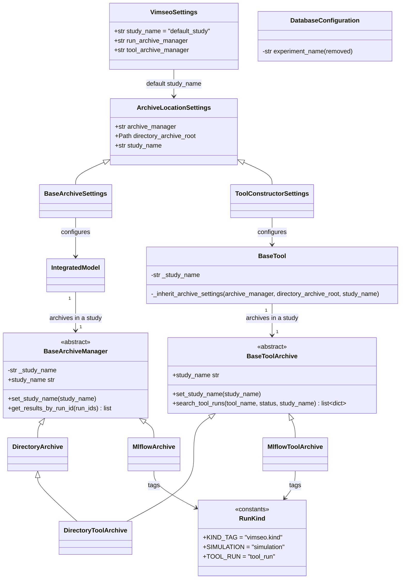

# Studies, the grouping of the simulations and of the tool runs of an archive

## Requirements

- Group the simulations and the tool runs of an archive by **study**, the same concept
  for both archive managers (`DirectoryArchive`, `MlflowArchive`) and for both kinds of
  runs, so that the runs of several studies (e.g. one per layup) share one archive
  without mixing.
- Make "experiment" an internal notion of MLflow. Today it means three different
  things: a path segment which *replaces* `{model}/{load_case}` in a
  `DirectoryArchive`, the MLflow experiment `{model}_{load_case}` in an
  `MlflowArchive`, and a fixed location of the tool runs (`tools/{tool_name}`,
  `"tools"`) which no setting can change.
- Keep every link between runs working across studies: a tool run and its simulations
  are found from one another whatever their studies.
- Out of scope: the scratch directories (disposable, unchanged), the migration of the
  existing archives, the working directories of the tools (SPEC-004 iteration 2).

Acceptance criteria:

- Given the default configuration, then the study is `default_study`; given
  `VIMSEO_STUDY_NAME=layup_A`, then it is `layup_A`.
- Given a `DirectoryArchive`, then a simulation is archived under
  `{root}/{study}/{model}/{load_case}/{job}/` and a tool run under
  `{root}/{study}/tools/{tool_name}/{tool_run_id}/`.
- Given an `MlflowArchive`, then the simulations and the tool runs of a study are runs
  of the single MLflow experiment `{study}`, with the tag `vimseo.kind` set to
  `simulation` or `tool_run`.
- Given a model and a tool created with the same `study_name`, then their runs are in
  the same study; given a subtool created without `study_name`, at any depth, then it
  uses the study of its top tool; given a subtool with an explicit `study_name`, then
  it keeps it.
- Given two models archived in the same MLflow study, then `get_archived_results` and
  `create_cache_from_archive` of each model only return its own simulations.
- Given simulations and tool runs in several studies, then `get_results_by_run_id`,
  `find_tool_runs_of_simulation`, `get_tool_result` and `tool-run:{tool_run_id}` find
  them whatever their study, and `search_tool_runs(study_name=...)` filters by study.
- Given `archive_manager.set_study_name("layup_B")`, then the next runs of the model
  are archived in `layup_B`; `set_experiment` and `experiment_name` no longer exist.
- Given an MLflow archive opened to read it, then no experiment is created.

## Entities

`study_name` is a plain `str`: no `Study` class, a study has no attribute of its own.

## Approach

1. One concept, two backends:
   - A study is the top-level grouping of an archive. It sits *above* the existing
     grouping by model and load case instead of replacing it:
     `{root}/{study}/{model}/{load_case}/` and `{root}/{study}/tools/{tool_name}/`.
   - In MLflow, a study is one experiment holding the simulations and the tool runs.
     The model, the load case and the kind of run are tags, so that the MLflow user
     interface shows a study in one place and filters it (`tags.vimseo.kind`,
     `tags.vimseo.model`).
   - "Experiment" is no longer a word of the VIMSEO API: it only names the MLflow
     experiment of a study inside `MlflowArchive` and `MlflowToolArchive`.
2. Settings:
   - `study_name` is a field of `ArchiveLocationSettings` (SPEC-004 iteration 1), shared
     by `IntegratedModelSettings` and `ToolConstructorSettings` with the same name and
     description (norm 5 of SPEC-004).
   - Its default is `config.study_name` for a model. For a tool, the field default is
     `""`, resolved like `archive_manager`: the study of the parent tool, else
     `config.study_name`. `BaseTool._inherit_archive_settings` propagates it to the
     subtools; an explicit value wins.
   - `config.study_name` is a top-level setting (`VIMSEO_STUDY_NAME`), not a field of
     `DatabaseConfiguration`: a study is not specific to MLflow.
   - Default `DEFAULT_STUDY_NAME = "default_study"`, not `"default"`, which would be
     confused with the MLflow experiment `Default` (id `0`) present in every database.
3. Queries:
   - The queries by identifier (`get_results_by_run_id`, `get_tool_result`,
     `find_tool_runs_of_simulation`, `tool-run:{tool_run_id}`) search every study: a
     tool run of one study may reuse, through the cache, a simulation of another one.
   - `search_tool_runs(study_name="")` searches every study; a `study_name` filters.
   - `get_archived_results` and `create_cache_from_archive` stay restricted to the
     current study, model and load case of the archive manager of a model.
   - The MLflow searches filter on `tags.vimseo.kind` instead of excluding the
     experiment named `"tools"`.
4. Tags written at the creation of an MLflow run:
   - A simulation run is created with `vimseo.kind=simulation`, `vimseo.model` and
     `vimseo.load_case`, from the `model_name` and `load_case_name` of the archive
     manager. The metadata tags `model` and `load_case`, written at publication, are
     not used to filter: `model` is the class name of the model, while the archive
     receives `model.name`, which may differ.
   - A tool run is created with `vimseo.kind=tool_run` and `vimseo.study_name`.
5. Rejected alternatives:
   - Keeping `set_experiment` as a deprecated alias of `set_study_name`: the meaning
     changes (a prefix instead of a replacement of `{model}/{load_case}`), so an alias
     would silently move the runs of an existing script. Removed, no alias.
   - One MLflow experiment per study and per model (`{study}/{model}_{load_case}`,
     `{study}/tools`): closer to today, but a study would be split in the user
     interface and the experiment name would encode three notions again.
   - A `Study` class: a study has no attribute of its own; a string is enough.
   - Separating the studies by `directory_archive_root` only (one archive per study):
     still possible, but the links across studies and the MLflow server shared by a
     team need a single archive.
   - Making a tool adopt the study of the model it executes: implicit, and a tool may
     execute several models; the configuration is the common default instead.

## Structure

### Inheritance Relationships

1. `BaseArchiveSettings` and `ToolConstructorSettings` extend `ArchiveLocationSettings`,
   which gains `study_name`.
2. `DirectoryArchive` and `MlflowArchive` implement `BaseArchiveManager`, which owns
   `_study_name`, `study_name` and `set_study_name`.
3. `DirectoryToolArchive` (extends `DirectoryArchive`) and `MlflowToolArchive` implement
   `BaseToolArchive`, which declares `study_name`, `set_study_name` and the
   `study_name` filter of `search_tool_runs`.

### Dependencies

1. `IntegratedModel.__init__` passes `study_name` to the archive manager constructor.
2. `BaseTool._open_tool_archive` passes the resolved `study_name` to
   `open_tool_archive(name, root, study_name)`.
3. `BaseCompositeTool` propagates `study_name` to its subtools through
   `_inherit_archive_settings`.
4. `MlflowArchive` and `MlflowToolArchive` import the kind tag constants from
   `vimseo.storage_management.run_kind`.
5. `uri.guess_archive_manager` and `load_tool_result` rely on the archive managers to
   search every study.

### Layered Architecture

1. `config/`: the default study (`VIMSEO_STUDY_NAME`).
2. `storage_management/`: the layout of a study in each backend, the searches across
   studies.
3. `core/`, `tools/`: the `study_name` setting of a model and of a tool, its
   inheritance by the subtools.
4. `dashboards/database_viewer/`: the choice of a study instead of an experiment.

## Operations

### Update configuration - `VimseoSettings`, `DatabaseConfiguration`

1. `config/configuration_settings.py`: add
   `study_name: str = Field(default=DEFAULT_STUDY_NAME, description="The study in which the simulations and the tool runs are archived.")`.
   `DEFAULT_STUDY_NAME = "default_study"` is defined in this module:
   `archive_settings.py` already imports the configuration, the reverse would be a
   cycle.
2. `config/config_components.py`: remove `DatabaseConfiguration.experiment_name`.
3. `docs/how_to/configuration.md`, `docs/user_guide/vimseo.env`: replace
   `VIMSEO_DATABASE__EXPERIMENT_NAME` by `VIMSEO_STUDY_NAME`.

### Create module - `vimseo/storage_management/run_kind.py`

1. `KIND_TAG = "vimseo.kind"`, `SIMULATION = "simulation"`, `TOOL_RUN = "tool_run"`,
   `MODEL_TAG = "vimseo.model"`, `LOAD_CASE_TAG = "vimseo.load_case"`, with a module
   docstring saying that they are the tags distinguishing the runs of a study in MLflow.
2. No MLflow import: the module is importable in the core profile.

### Update settings - `ArchiveLocationSettings`

1. Add `study_name: str = Field(default=config.study_name, description="The study grouping the runs in the archive: a directory {root}/{study}/ of a DirectoryArchive, an experiment of an MlflowArchive.")`.
2. `ToolConstructorSettings` overrides the default with `""` and its description adds
   "If empty, the study of the parent tool, else the one of the configuration."

### Update archive manager - `BaseArchiveManager`

1. `__init__(..., study_name: str = "")`: `self._study_name = study_name or config.study_name`.
2. Rename `experiment_name` → `study_name` (property) and `set_experiment` →
   `set_study_name(study_name: str) -> None`.
3. Docstring of `get_results_by_run_id`: "The whole archive is searched, whatever the
   study."

### Update archive manager - `DirectoryArchive`

1. Remove the reading of `config.database.experiment_name`; the job sub-path is
   `Path(self._study_name, model_name, load_case_name)`, always.
2. `set_study_name` updates the study only: the model and load case segments are kept.
3. `create_job_directory` and `get_archived_results` use that sub-path;
   `get_results_by_run_id` is unchanged (it walks the whole root).

### Update archive manager - `MlflowArchive`

1. The experiment name is `self._study_name`.
2. `set_study_name(study_name)`: set the name only; the experiment is created with the
   first run (no `tags` argument: it was unused).
3. `create_job_directory`: create the run with the tags `KIND_TAG=SIMULATION`,
   `MODEL_TAG=model_name`, `LOAD_CASE_TAG=load_case_name`.
4. `_search_finished_run_ids`: in the experiment of the study, if it exists (else
   `[]`, without creating it), filter
   `attributes.status = 'FINISHED' and tags.\`vimseo.kind\` = 'simulation' and tags.\`vimseo.model\` = '{model}' and tags.\`vimseo.load_case\` = '{load_case}'`.
5. `get_archived_results`: `dir_archive_job` is `f"{study}/{model}_{load_case}"`.
6. `get_results_by_run_id`: search all the experiments with the filter
   `tags.\`vimseo.kind\` = 'simulation' and tags.run_id = '{run_id}'`, replacing the
   exclusion of the experiment named `"tools"`.

### Update scratch - `DirectoryScratch`

1. Rename the internal attribute `_experiment_name` → `_job_sub_path`; the layout is
   unchanged.

### Update tool archives - `tool_archive/`

1. `__init__.py`: `open_tool_archive(name, root_directory, study_name="")`, passed to
   the constructors; `NullToolArchive` ignores it.
2. `base_tool_archive.py`:
   - `create_summary(..., study_name="")` adds `"study_name"` to the summary.
   - `BaseToolArchive`: abstract `search_tool_runs(tool_name="", status="", study_name="")`;
     concrete `study_name` property and `set_study_name`.
3. `directory_tool_archive.py`:
   - `__init__(root_directory, study_name="")`.
   - `start_tool_run`: job sub-path `{study}/tools/{tool_name}`, run name
     `tool_run_id` (no call to the removed `set_experiment`).
   - `_find_run_directory`, `get_tool_result`, `find_tool_runs_of_simulation`: glob
     `*/tools/{tool_name or '*'}/{tool_run_id}` (every study).
   - `search_tool_runs`: glob `{study_name or '*'}/tools/{tool_name or '*'}/*/*{SUMMARY_SUFFIX}`.
4. `mlflow_tool_archive.py`:
   - Remove `EXPERIMENT_NAME`; `__init__(root_directory="", study_name="")`;
     `experiment_id` is the one of the experiment of the study, created on first write.
   - `start_tool_run`: add the tags `KIND_TAG=TOOL_RUN` and `vimseo.study_name`.
   - `_search_runs(filter_string, study_name=None)`: the experiment of `study_name`
     (`None`: the current study; `""`: all the experiments), always ANDed with
     `tags.\`vimseo.kind\` = 'tool_run'`; never creates an experiment.
   - `_find_run`, `get_tool_result`, `find_tool_runs_of_simulation`: all the
     experiments. `search_tool_runs(..., study_name="")`: all, or the given study.
   - `_get_simulation_experiment_ids`: the experiment of the current study if it
     exists, else all the experiments; the simulations are selected by
     `tags.\`vimseo.kind\` = 'simulation'`. No more `config.database.experiment_name`.
   - Docstring of the class: the tree `{study} (experiment) → DesignValueTool → DOETool`.
5. `uri.py`: `guess_archive_manager` returns `DirectoryArchive` when the root holds a
   `*/tools` directory; docstrings say "whatever the study".

### Update tool - `BaseTool`, `BaseCompositeTool`

1. `BaseTool.__init__(..., study_name: str = "")`, stored as `self._study_name`.
2. `_open_tool_archive(archive_manager, directory_archive_root, study_name)`: resolves
   `study_name or config.study_name`.
3. `_inherit_archive_settings(archive_manager, directory_archive_root, study_name)`:
   `study_name = self._study_name or study_name`; reopen the archive only if a resolved
   setting changed. Same signature in `BaseCompositeTool`, which forwards to its
   subtools.

### Update model - `IntegratedModel`

1. `base_integrated_model.py`: add `"study_name": options["study_name"]` to
   `archive_options`.

### Update dashboard - database viewer

1. `db_viewer.py`, `db_viewer_model.py`: the text input "Choose a study" (key
   `study_name`) calls `model.archive_manager.set_study_name`.

### Update docs and examples

1. `docs/runnable_examples/02_integrated_models/plot_03_model_result_management.py`:
   the table of the paths becomes `{root}/{study}/{model}/{load_case}/{job}`, rows
   with `set_study_name("my_study")`; the MLflow searches use
   `experiment_names=[study]` and `tags.vimseo.model`.
2. `docs/runnable_examples/13_tool_result_management/plot_01_*.py`: the model and the
   tools get the same `study_name`; the path of a tool run is
   `archive_root / study / "tools" / ...`.
3. `docs/runnable_examples/13_tool_result_management/plot_02_*.py`: the experiment
   `tools` and `BendingTestAnalytical_ThreePoints` become the experiment of the study,
   filtered by `vimseo.kind`.
4. `docs/how_to/run_a_study.md`: separate the layups by `study_name` (or
   `VIMSEO_STUDY_NAME`), not by `root_directory`.
5. `CHANGELOG.md`: the breaking changes of Safeguards.

### Update tests

1. Adapt: `tests/storage_management/test_directory_archive.py` (accessors),
   `test_results_by_run_id.py` (a second study instead of a second experiment),
   `test_mlflow_archive.py` (`study_name`), `test_tool_archive.py` (experiment of the
   study, kind tags), `tests/dashboards/test_db_viewer.py` (key `study_name`).
2. Add, on both backends where relevant (`fast` unless MLflow is needed): one test per
   acceptance criterion, including two models in one MLflow study, a subtool inheriting
   or overriding the study, `search_tool_runs(study_name=...)`, `tool-run:` across
   studies, `VIMSEO_STUDY_NAME`, and "no experiment created when reading".

## Norms

1. The shared norms of `docs/specs/index.md`.
2. "Experiment" appears only inside `MlflowArchive` and `MlflowToolArchive`, as the
   MLflow experiment of a study; the public API, the settings and the docs say "study".
3. A study is a `str` named `study_name` everywhere: settings, arguments, summary,
   MLflow tag `vimseo.study_name`, configuration `VIMSEO_STUDY_NAME`.
4. The MLflow tags written by VIMSEO are prefixed by `vimseo.` and come from
   `run_kind.py` or `_tag()`; no literal tag name elsewhere.
5. Every MLflow search goes through the client of the archive (SPEC-002) and never
   creates an experiment.

## Safeguards

1. Breaking change (`feat(storage)!`): `set_experiment`, `experiment_name` and
   `VIMSEO_DATABASE__EXPERIMENT_NAME` are removed without alias. Migration: replace
   `set_experiment(name)` by `set_study_name(name)` and the variable by
   `VIMSEO_STUDY_NAME`; the runs keep their `{model}/{load_case}` grouping under the
   study. The old variable in a `.env` file makes `VimseoSettings()` fail with a
   `ValidationError`.
2. Breaking change: the layout of the archives. The existing simulations
   (`{root}/{model}/{load_case}/`, experiment `{model}_{load_case}`) and tool runs
   (`{root}/tools/`, experiment `tools`) are no longer read by `get_archived_results`,
   `create_cache_from_archive` and `search_tool_runs`. `get_results_by_run_id` of a
   `DirectoryArchive` still finds old simulations (it walks the root). No migration
   tool: the tool archive is not released yet, and an old archive stays readable by
   path (`load_tool_result(<directory>)`, `JobBundle`).
3. Prerequisite: SPEC-004 iteration 1 (`ArchiveLocationSettings`,
   `directory_archive_root` for the tools) is implemented first.
4. Functional: reading an archive never creates a directory nor an MLflow experiment
   (SPEC-005 safeguard 1, SPEC-007 safeguard 2).
5. Functional: a tool run and its simulations stay linked when they are in different
   studies.
6. Integration: `run_kind.py` imports nothing from MLflow; `tox -e core-py312` passes.
7. Tests: `pytest tests/storage_management tests/tools tests/dashboards`,
   `tox -e py312`, `tox -e core-py312`, and the examples `02/plot_03`, `13/plot_01`,
   `13/plot_02` run.

## Open questions

1. Should a tool without `study_name` adopt the study of the model it executes, rather
   than the configuration? Not in this version (see Approach 5).
2. Mixing the simulations of several models in one MLflow experiment shows the union of
   their metrics and params as columns in the user interface. Acceptable, or should
   the user interface be documented with a saved filter per model?
3. Should `get_archived_results` accept a `study_name` argument, to build a cache from
   another study without changing the current one?
4. Should a script migrating an old archive into `default_study` be provided?
